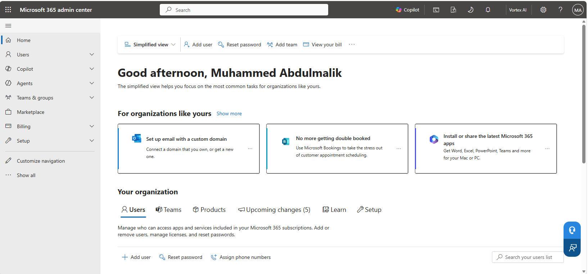
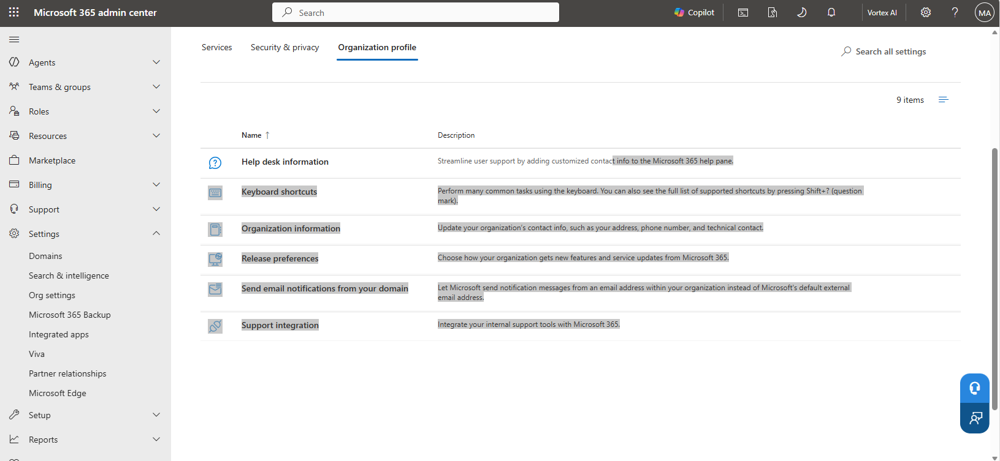
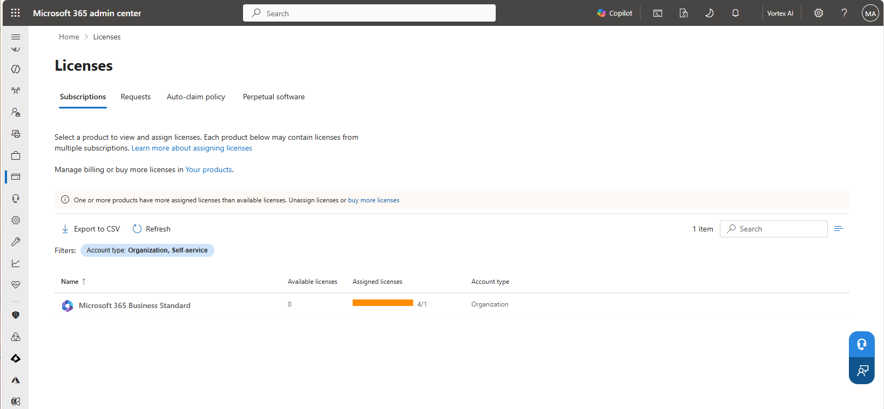
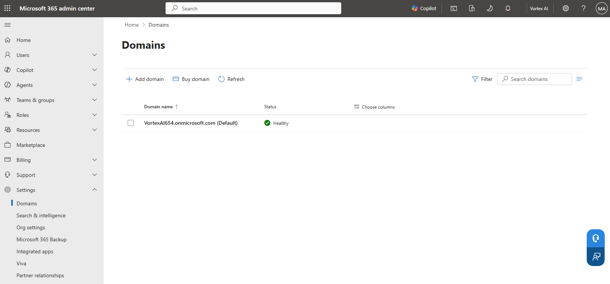
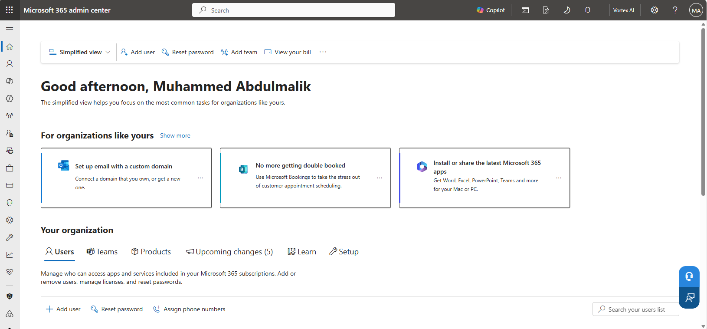

# Lab 00 — Tenant Design and Provisioning

**Objective:** Assess, baseline and document an existing Microsoft 365 tenant, and close the
capability gap between the licence tier on hand and the tier the remaining labs require.
**Environment:** Microsoft 365 tenant `VortexAI654.onmicrosoft.com`, no custom domain.
**Prerequisites:** None.
**Duration:** Approximately 45 minutes.

---

## 1. Scenario

The tenant used for this project already existed rather than being created from scratch, which
is closer to how most administrative work actually starts: inheriting an environment rather than
building one. The task here is not provisioning but assessment — establishing what the tenant
actually holds before configuring anything on top of it, and confirming that its licence tier is
sufficient for the identity, security, and compliance work planned in Labs 01 through 12.

---

## 2. Design decisions

| Decision | Options considered | Selected | Rationale |
|---|---|---|---|
| Custom domain | Add and verify a purchased domain; use the initial `.onmicrosoft.com` domain | Use the initial domain | No production domain was available to dedicate to a lab tenant without risking live mail flow. `VortexAI654.onmicrosoft.com` is used as the UPN suffix throughout, consistent with the fallback this repository documents in [docs/naming.md](../../docs/naming.md) §3.2. |
| Licence tier | Stay on Business Standard; activate a Microsoft 365 E5 trial | Activate the E5 trial | The tenant's existing Business Standard subscription was already over-assigned (4 licences consumed against 1 seat) and does not include Entra ID P1/P2, Intune, Purview DLP, or Defender for Office 365 Plan 2 — all required by later labs. A Microsoft 365 E5 trial stacks alongside the existing subscription and unlocks every lab at no additional cost inside the trial window. |

---

## 3. Implementation

### Step 1 — Record the inherited tenant state

Rather than provisioning a new tenant, the starting point was the admin center's own landing
page for the account already in place.



---

### Step 2 — Review the organisation profile

The organisation's contact, branding, and support settings were reviewed under **Settings →
Org settings → Organization profile** before making any changes, to establish what had already
been configured versus what remained at Microsoft's defaults.



---

### Step 3 — Baseline the licence position

```powershell
Connect-MgGraph -Scopes 'Organization.Read.All'

Get-MgSubscribedSku |
    Select-Object SkuPartNumber,
                  @{ n = 'Enabled';   e = { $_.PrepaidUnits.Enabled } },
                  ConsumedUnits
```

The admin center's own **Licenses** page showed the same picture: a single Microsoft 365
Business Standard subscription with **one** available seat against **four** assigned licences —
an over-assignment the portal flags directly ("One or more products have more assigned licenses
than available licenses"). Business Standard also does not include Entra ID P1, which blocks
Conditional Access and group-based licensing before Lab 01 even starts.



---

### Step 4 — Close the gap with a Microsoft 365 E5 trial

A Microsoft 365 E5 trial was activated from **Billing → Purchase services** to stack alongside
the existing Business Standard subscription. `[CONFIRM: exact activation date and trial
duration]` — the trial's effect is visible from Lab 01 onward, where accounts consistently carry
Microsoft 365 E5 and Microsoft Entra ID P2 licences, and Lab 09 confirms 25 total Intune
licences available across the tenant.

---

### Step 5 — Confirm the domain in use

No custom domain was added. The tenant's only domain is its initial, immutable
`VortexAI654.onmicrosoft.com`, confirmed healthy under **Settings → Domains**.



---

### Step 6 — Confirm the tenant baseline after assessment

With the licence gap closed and the domain confirmed, the admin center home page was revisited
as the closing baseline check before Lab 01 begins provisioning accounts against it.



---

## 4. Verification

| Check | Command | Success criterion |
|---|---|---|
| Tenant identity | `Get-MgOrganization` | Display name and tenant ID returned for `VortexAI654.onmicrosoft.com` |
| Licence inventory | `Get-MgSubscribedSku` | Business Standard **and** Microsoft 365 E5 SKUs both present |
| Domain | Admin center → Domains | `VortexAI654.onmicrosoft.com` shown as default and healthy |

---

## 5. Faults encountered

### 5.1 Business Standard licences over-assigned against available seats

**Symptom.** The Licenses page showed 4 assigned licences against only 1 available Business
Standard seat, with the admin center's own "more assigned than available" warning banner.

**Diagnosis.** `Get-MgSubscribedSku` confirmed `ConsumedUnits` (4) exceeding
`PrepaidUnits.Enabled` (1) for the `O365_BUSINESS_PREMIUM` SKU — the part number that,
confusingly, corresponds to Business *Standard* rather than Business *Premium*. The string
contains the word "premium" but the product is Standard, and it does **not** include Entra ID
P1 — a naming collision worth watching for, since it causes more incorrect capability
assumptions than any other in Microsoft 365 licensing.

**Cause.** The tenant had more user accounts requiring a licence than paid Business Standard
seats, and none of those accounts could take Entra ID P1-dependent features regardless, since
Business Standard doesn't include it.

**Resolution.** Activated a Microsoft 365 E5 trial (Step 4) rather than purchasing additional
Business Standard seats, since the remaining labs need Entra ID P2, Intune, and Purview
regardless of seat count.

---

## 6. Capabilities demonstrated

- Microsoft 365 tenant assessment and licence-gap analysis against planned administrative work
- Reading `SkuPartNumber` naming correctly, including the Business Standard/Premium naming
  collision
- Cost-aware capability planning (trial activation vs. incremental seat purchase)
- Domain configuration review via the Microsoft 365 admin center

---

## 7. References

| Source | Behaviour confirmed |
|---|---|
| Microsoft Learn — *Microsoft 365 product names and service plan identifiers* | `SkuPartNumber` to product mapping, including the Business Standard/Premium naming collision |
| Microsoft Learn — *Assign licenses to users by group membership* | Entra ID P1 requirement for group-based licensing, motivating the E5 trial decision |

---

## Screenshot checklist

| File | Content |
|---|---|
| `00-01-tenant-home.png` | Admin center home page for the inherited tenant |
| `00-02-organization-profile.png` | Organization profile settings under Org settings |
| `00-03-license-overview.png` | Licenses page showing Business Standard over-assigned |
| `00-04-domain-verification.png` | Domains page confirming the initial domain, healthy, no custom domain |
| `00-05-tenant-id-overview.png` | Admin center home page revisited as the post-assessment baseline |
