# Lab 02 — Administrative Roles and Least Privilege

**Objective:** Assign directory roles against the principle of least privilege, using both
standing role assignment and time-bound Privileged Identity Management (PIM) activation.
**Environment:** Microsoft 365 tenant `VortexAI654.onmicrosoft.com`.
**Prerequisites:** Labs 00, 01.
**Duration:** Approximately 45 minutes.

---

## 1. Scenario

A single Global Administrator account is a single point of failure and a standing high-value
target: if it's compromised, everything is compromised. This lab spreads administrative
capability across the roster using the least privilege each task actually needs — a built-in
Helpdesk Administrator role for day-to-day account support, and PIM-managed, time-bound
elevation for the Global Administrator role itself, rather than leaving it permanently active.

---

## 2. Design decisions

| Decision | Options considered | Selected | Rationale |
|---|---|---|---|
| Helpdesk delegation | A custom role scoped to specific permissions; the built-in Helpdesk Administrator role | Built-in Helpdesk Administrator | The built-in role's permission set (password reset, licence and group assignment support, no directory-wide write access) already matched the helpdesk scenario in Lab 12. A custom role was still built once, from scratch, to confirm the mechanism and its permissions editor before deciding it wasn't needed here. |
| Global Administrator activation | Permanent standing assignment; PIM-managed eligible assignment | PIM-managed | A Global Administrator account that's always active is always a target. Making the role PIM-eligible instead means it's activated only when needed, for a bounded window, with the activation itself recorded in the audit log picked up in Lab 10. |

---

## 3. Implementation

### Step 1 — Build and review a custom role

Before relying on the built-in Helpdesk Administrator role, the custom role editor was used to
confirm what a role built from scratch actually exposes — its own permissions tab, separate
from the built-in role's fixed permission set.

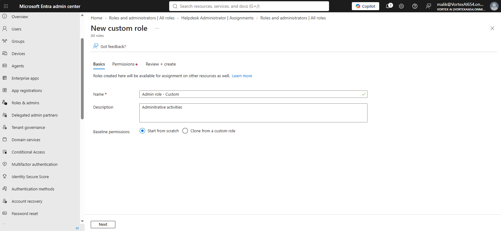

The New custom role wizard, used to confirm what a role built entirely from scratch exposes in its own permissions editor, before deciding the built-in Helpdesk Administrator role was actually the better fit.

---

### Step 2 — Assign the Helpdesk Administrator role

The built-in Helpdesk Administrator role was assigned directly to John Ebuka, and — visible in
the same session's notifications — to Frank Dugald and to the administrator account.

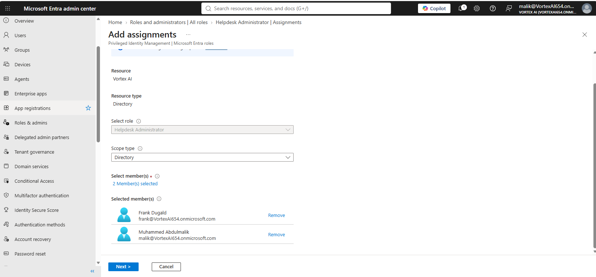

The role-assignment flow for the built-in Helpdesk Administrator role.

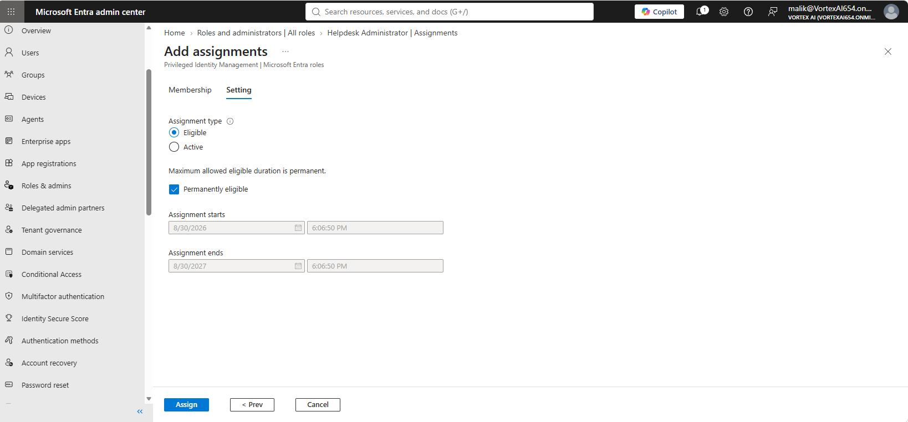

The assignment flow continued, selecting the specific member to receive the role.

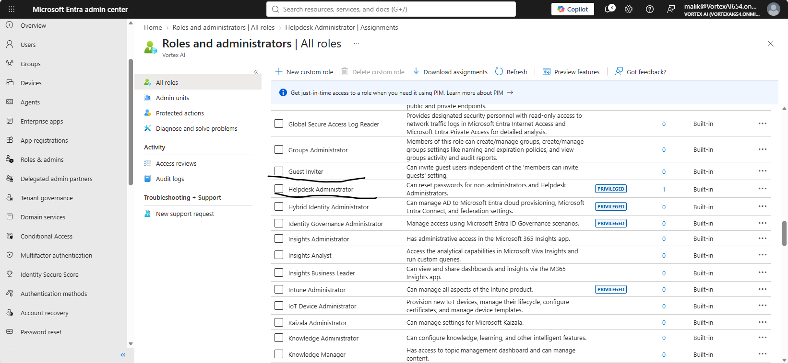

Confirmation that the Helpdesk Administrator role was assigned to Frank Dugald.

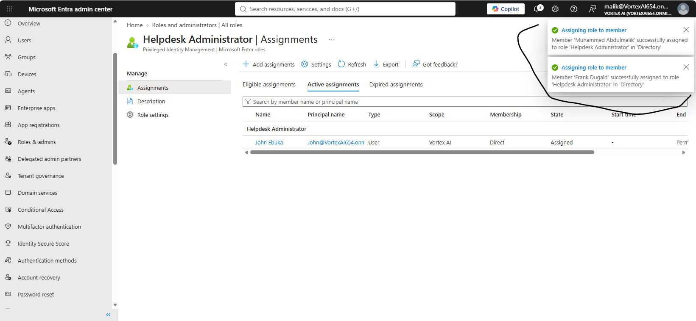

The Helpdesk Administrator role's active assignments, listing John Ebuka directly and confirming — via the session's own notifications — that the administrator and Frank Dugald were assigned the same role.

---

### Step 3 — Move Global Administrator to PIM-managed activation

```powershell
Connect-MgGraph -Scopes 'RoleManagement.ReadWrite.Directory'
```

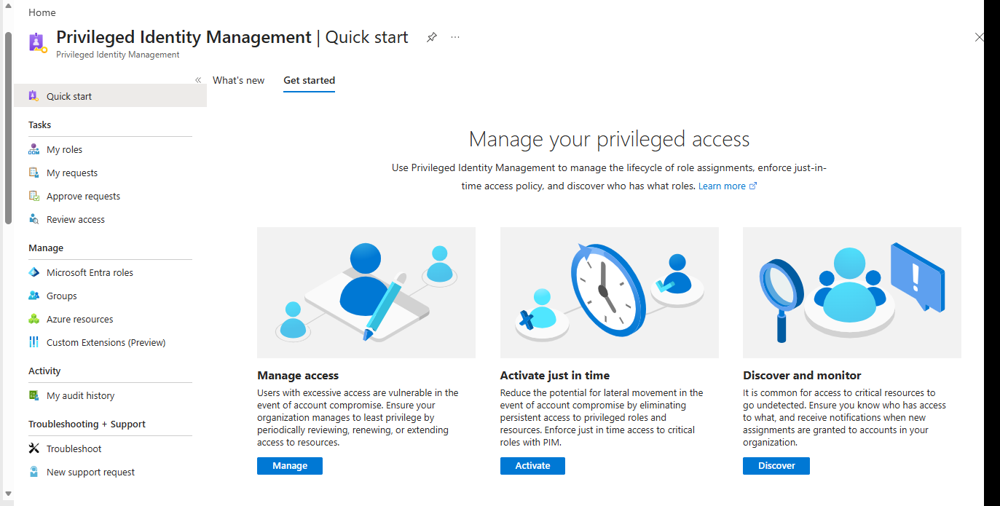

Privileged Identity Management's overview for Microsoft Entra roles, the starting point for converting the Global Administrator role to time-bound activation.

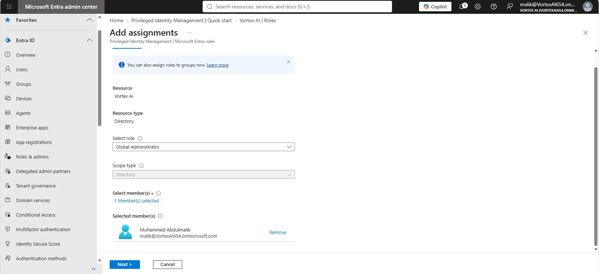

The PIM Add assignments panel, scoping the Global Administrator role to the directory and selecting the administrator account to receive it.

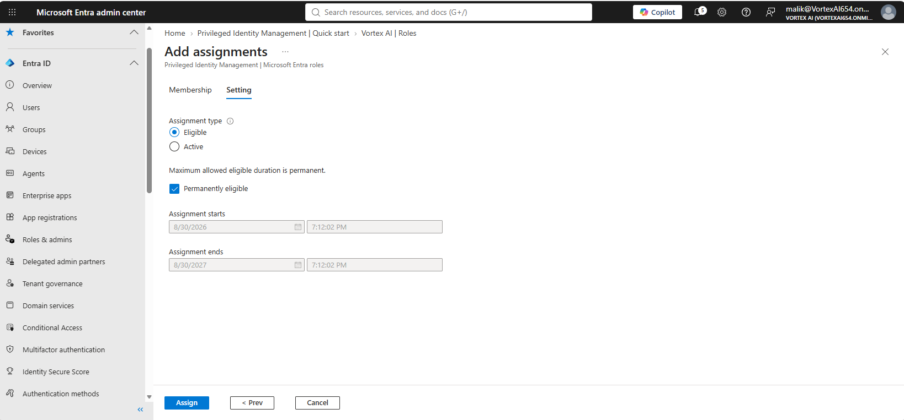

The assignment flow continued, where the eligibility and activation duration settings are configured.

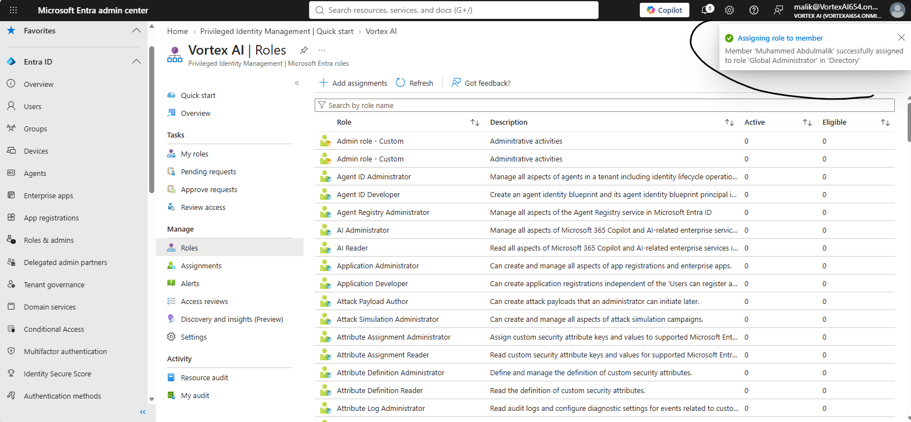

Confirmation that the Global Administrator role is now PIM-managed rather than a standing assignment.

---

### Step 4 — Incidental Exchange configuration review

While working in the admin centers for this lab, two Exchange settings were reviewed as a
quick sanity check on what already existed in the tenant — properly the subject of Lab 05, but
captured here as they came up.

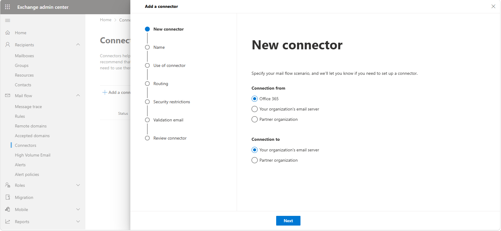

Exchange connectors reviewed and confirmed as none configured — the expected state for a cloud-only tenant with no on-premises hybrid mail relay.

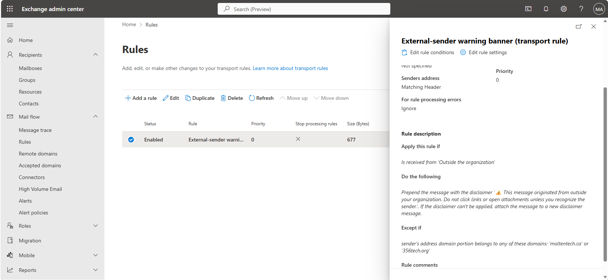

An existing Exchange transport rule reviewed: an external-sender warning banner with an exception for two trusted partner domains.

---

## 4. Verification

| Check | Command | Success criterion |
|---|---|---|
| Helpdesk role assignment | PIM → Helpdesk Administrator → Active assignments | John Ebuka, Frank Dugald, and the administrator listed |
| Global Administrator assignment type | PIM → My roles | Global Administrator shows as **Eligible**, not permanently Active |
| Connectors | Exchange admin center → Connectors | None configured |

```powershell
Get-MgRoleManagementDirectoryRoleAssignment -Filter "roleDefinitionId eq '<HelpdeskAdministratorId>'" |
    Select-Object PrincipalId, DirectoryScopeId
```

---

## 5. Faults encountered

No faults were encountered during this lab.

---

## 6. Capabilities demonstrated

- Custom directory role creation and permission scoping
- Least-privilege delegation using built-in roles matched to the actual task
- Privileged Identity Management: converting a standing Global Administrator assignment to a
  time-bound, eligible one
- Exchange connector and transport rule review

---

## 7. References

| Source | Behaviour confirmed |
|---|---|
| Microsoft Learn — *Assign Microsoft Entra roles in Privileged Identity Management* | Eligible vs. active assignment, and activation duration |
| Microsoft Learn — *Create and assign a custom role* | Custom role permission scoping |

---

## Screenshot checklist

| File | Content |
|---|---|
| `02-01-custom-role-created.png` | New custom role wizard |
| `02-02-role-assigned.png` | Helpdesk Administrator active assignments |
| `02-03-assign-helpdesk-role.png` | Assigning the Helpdesk Administrator role |
| `02-04-assign-helpdesk-role-2.png` | Assigning the Helpdesk Administrator role, continued |
| `02-05-helpdesk-role-frank.png` | Helpdesk Administrator assignment confirmed for Frank Dugald |
| `02-06-pim-overview.png` | PIM overview for Microsoft Entra roles |
| `02-07-pim-role-assignment.png` | Add assignments: Global Administrator via PIM |
| `02-08-pim-role-assignment-2.png` | PIM role assignment, duration/eligibility settings |
| `02-09-pim-role-assigned.png` | Global Administrator PIM assignment confirmed |
| `02-10-connectors-reviewed.png` | Exchange connectors reviewed, none configured |
| `02-11-existing-rule-review.png` | Existing transport rule reviewed |
