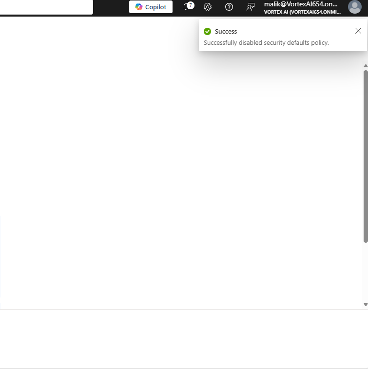
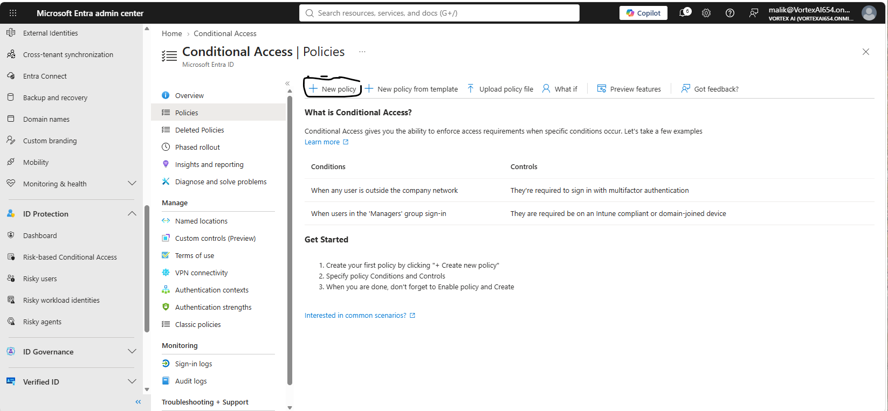
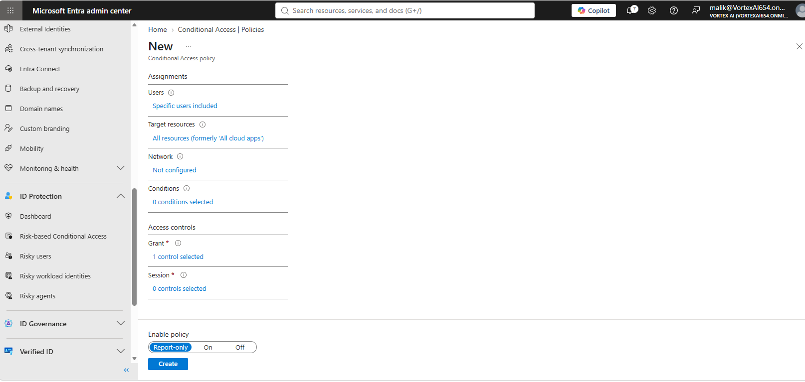
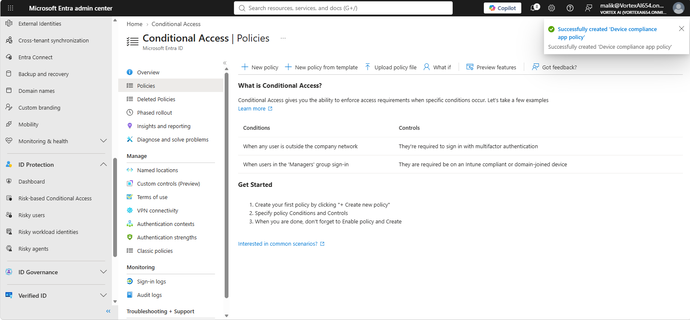
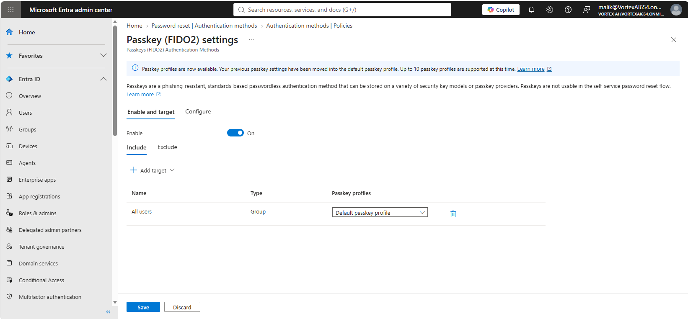
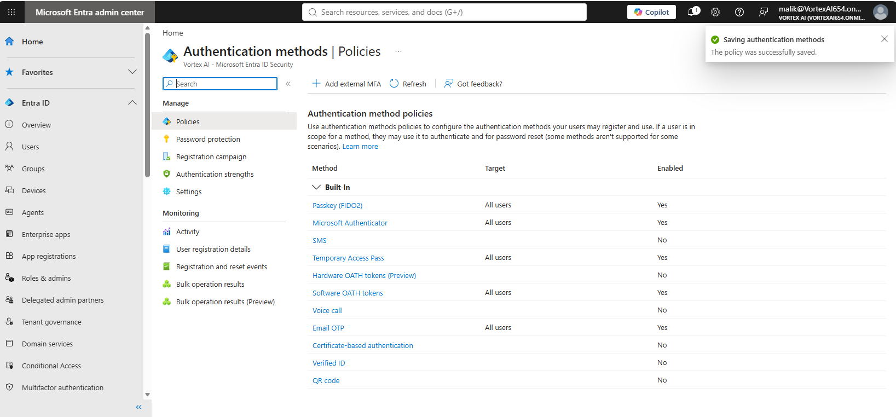
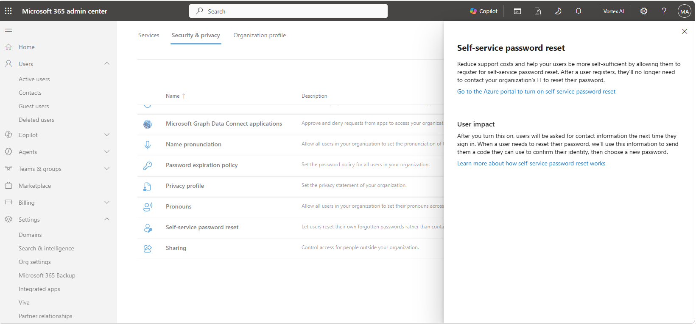
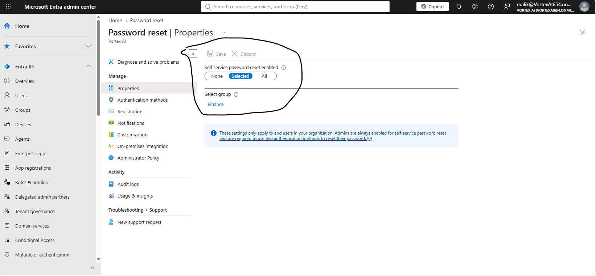

# Lab 03 — Authentication and Conditional Access

**Objective:** Disable security defaults in favour of Conditional Access, roll out a device
compliance policy safely in report-only mode, and strengthen the authentication methods
available to users.
**Environment:** Microsoft 365 tenant `VortexAI654.onmicrosoft.com`.
**Prerequisites:** Labs 00–02.
**Duration:** Approximately 60 minutes.

---

## 1. Scenario

Conditional Access is the control that can lock an administrator out of their own tenant
permanently if it's misconfigured and enforced too early. This lab's approach reflects that:
every policy here was built and reviewed in **report-only** mode rather than switched straight
to On, so its real-world impact can be checked against sign-in logs before it can block anyone.

---

## 2. Design decisions

| Decision | Options considered | Selected | Rationale |
|---|---|---|---|
| Baseline security control | Security defaults; Conditional Access | Conditional Access | Security defaults are all-or-nothing. Conditional Access allows the specific, scoped policy built here — a device compliance requirement for specific users — rather than a blanket rule, and is the control every other identity-security lab in this repository assumes is available. |
| Policy rollout state | Enable immediately; Report-only | Report-only | The policy targets specific users and all resources — broad enough that an error in scoping would be disruptive. Report-only surfaces exactly who the policy *would* have blocked, via **Insights and reporting**, before it can block anyone for real. |

---

## 3. Implementation

### Step 1 — Disable security defaults

Security defaults and Conditional Access are mutually exclusive; security defaults were turned
off first so a Conditional Access policy could take effect at all.



Security defaults being turned off, a required first step since security defaults and Conditional Access cannot both be active.

---

### Step 2 — Build a Conditional Access policy in report-only mode



The Conditional Access Policies landing page in the Entra admin center, where a new policy is started.

A new policy — **Device compliance app policy** — was scoped to specific users and all
resources, with a single grant control requiring the signing-in device to be marked compliant.
It was created with **Enable policy** set to **Report-only**, not On.



The new policy's configuration: scoped to specific users and all resources, with one grant control, and Enable policy deliberately left on Report-only rather than On.



Confirmation that the 'Device compliance app policy' Conditional Access policy was created.

This policy is the Conditional Access half of the device-compliance pairing completed in
Lab 09, where the matching Intune compliance policy is built and the two are linked together.

---

### Step 3 — Strengthen authentication methods

A passkey was configured as an available authentication method, and the tenant's default
authentication method was updated accordingly.



A passkey being registered as an available authentication method.



The tenant's authentication method configuration, saved with the new default method in place.

---

### Step 4 — Enable self-service password reset

```powershell
Connect-MgGraph -Scopes 'Policy.ReadWrite.Authorization'
```



Self-service password reset settings, reviewed before enabling the feature.



Confirmation that self-service password reset is enabled for the tenant.

---

## 4. Verification

| Check | Command | Expected result |
|---|---|---|
| Security defaults | Entra ID → Properties → Manage security defaults | Disabled |
| Conditional Access policy | Conditional Access → Policies | "Device compliance app policy" present, state Report-only |
| SSPR | Entra ID → Password reset | Enabled |

---

## 5. Faults encountered

### 5.1 No break-glass accounts were created before this lab

**Symptom.** None — this is a gap identified on review rather than an error encountered during
the build.

**Cause.** Standard Conditional Access practice calls for two break-glass accounts, excluded
from every policy, created *before* any policy work begins. No such accounts exist in the
active users list reviewed across Labs 01 and 12.

**Resolution.** Because the policy built here was created in report-only mode and scoped to
specific users rather than enforced tenant-wide, the absence of a break-glass account did not
create a lockout risk in this instance. It remains a real gap against the documented standard.
`[CONFIRM: was a break-glass account created outside of what these screenshots capture?]` If
not, creating two — on the initial domain, excluded from all Conditional Access policies,
credentials stored offline — should happen before any policy in this lab is switched from
Report-only to On.

---

## 6. Capabilities demonstrated

- Conditional Access policy design, scoped by user and resource
- Safe policy rollout using report-only mode ahead of enforcement
- Passkey and authentication method configuration
- Self-service password reset enablement
- Recognising and documenting a gap against a documented security standard, rather than silently
  closing it with an unverified claim

---

## 7. References

| Source | Behaviour confirmed |
|---|---|
| Microsoft Learn — *Conditional Access: Report-only mode* | Report-only evaluates policy impact without enforcing it |
| Microsoft Learn — *Security defaults vs. Conditional Access* | The two are mutually exclusive |
| Microsoft Learn — *Passkeys (FIDO2) in Microsoft Entra ID* | Passkey enrolment as an authentication method |

---

## Screenshot checklist

| File | Content |
|---|---|
| `03-01-ca-new-policy.png` | Conditional Access policies landing page |
| `03-02-ca-policy-created.png` | Policy created confirmation |
| `03-03-ca-policy-creation-detail.png` | New policy: assignments and Report-only setting |
| `03-04-security-defaults-disabled.png` | Security defaults disabled |
| `03-05-auth-method-default.png` | Authentication method saved as default |
| `03-06-passkey-setup.png` | Passkey set up |
| `03-07-sspr-settings.png` | Self-service password reset settings |
| `03-08-sspr-enabled.png` | Self-service password reset enabled |
