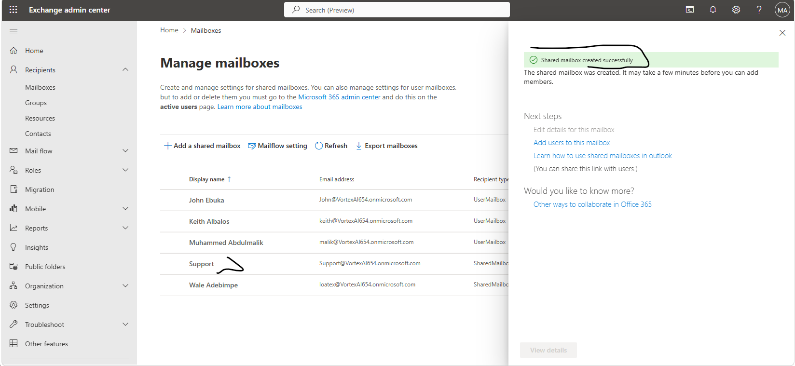
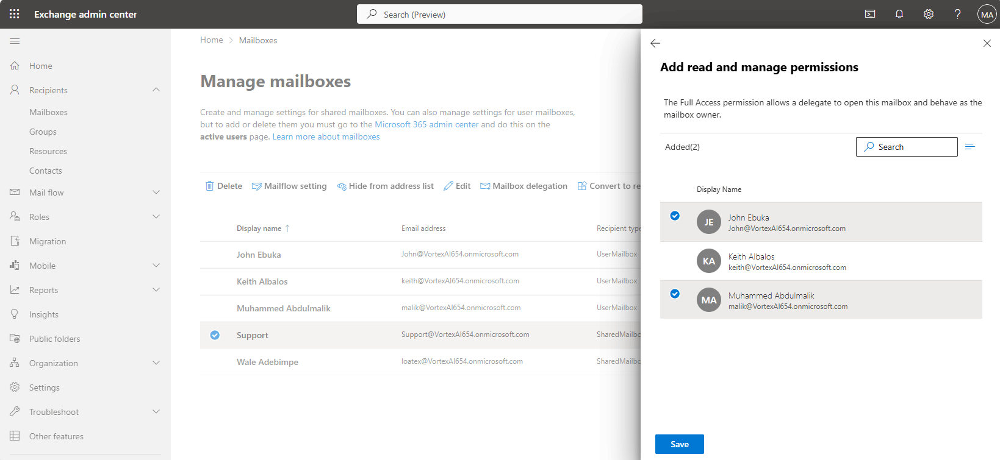
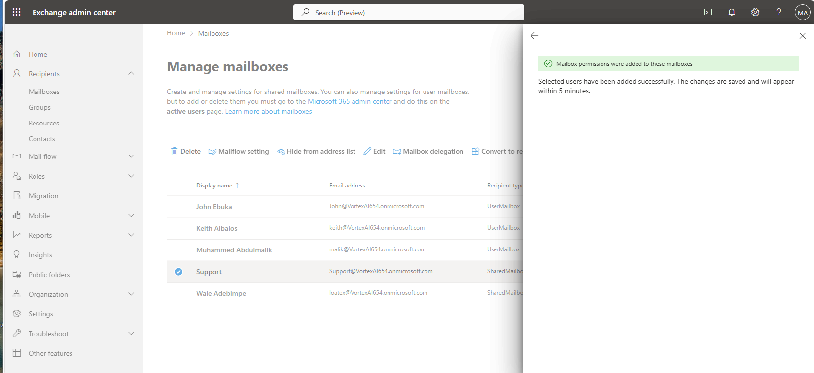
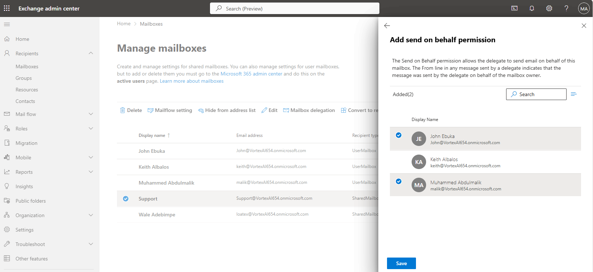
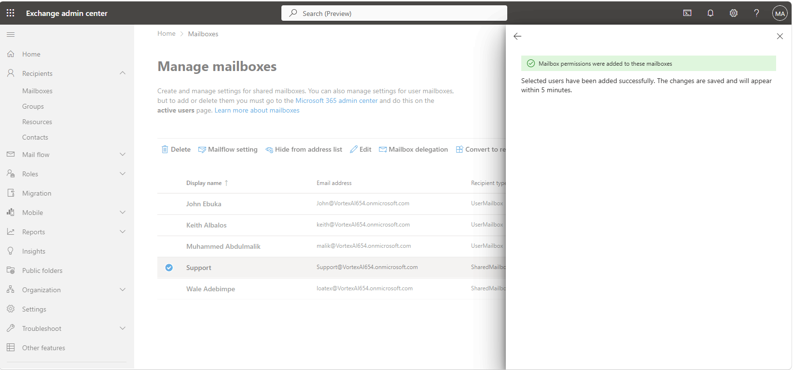
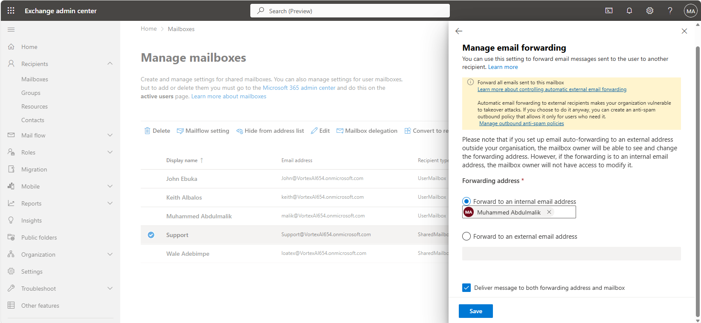
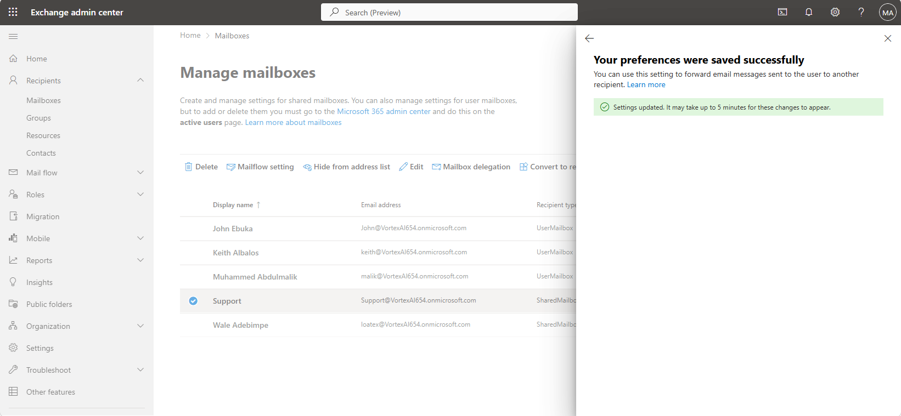
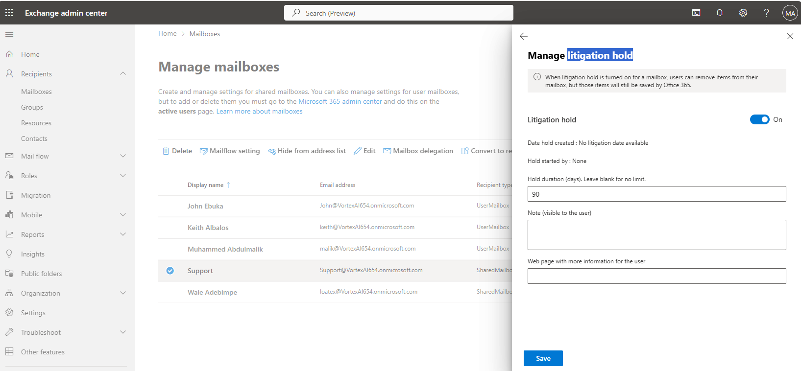

# Lab 04 — Exchange Online Mailbox Administration

**Objective:** Provision a shared mailbox, delegate access to it with the correct permission
model, configure external mail forwarding, and apply a litigation hold.
**Environment:** Microsoft 365 tenant `VortexAI654.onmicrosoft.com`.
**Prerequisites:** Labs 00, 01.
**Duration:** Approximately 60 minutes.

---

## 1. Scenario

Staff needed a shared point of contact that isn't tied to one person's inbox, with more than
one team member able to act as that mailbox — reading, sending as it, and sending on its
behalf. Getting the permission model right matters here: "Send As" and "Send on Behalf" look
similar in the admin center but produce a different result in the recipient's inbox, and mixing
them up on a shared mailbox is a common real-world support ticket.

---

## 2. Design decisions

| Decision | Options considered | Selected | Rationale |
|---|---|---|---|
| Delegate permission model | Full Access only; Full Access + Send As; Full Access + Send on Behalf | All three demonstrated | Full Access alone lets a delegate open the mailbox but not send from it. Send As sends with no visible distinction from the mailbox owner. Send on Behalf sends clearly marked "on behalf of," preserving accountability for who actually sent a given message — the more appropriate choice for a shared mailbox where traceability matters. |
| Mailbox retention | No hold; litigation hold | Litigation hold applied | A shared mailbox used for external-facing correspondence is exactly the kind of mailbox that needs its content preserved regardless of user-side deletion, ahead of any specific legal or compliance need arising. |

---

## 3. Implementation

### Step 1 — Create the shared mailbox

```powershell
Connect-ExchangeOnline -ShowBanner:$false

New-Mailbox -Shared -Name 'Support' -DisplayName 'Support' `
    -PrimarySmtpAddress 'support@VortexAI654.onmicrosoft.com'
```



Confirmation that the Support shared mailbox was created.

---

### Step 2 — Grant Full Access

```powershell
Add-MailboxPermission -Identity 'support@VortexAI654.onmicrosoft.com' `
    -User 'keith@VortexAI654.onmicrosoft.com' -AccessRights FullAccess -AutoMapping $true
```



Full Access permission granted to a delegate, allowing them to open and read the shared mailbox directly.

---

### Step 3 — Grant Send As

```powershell
Add-RecipientPermission -Identity 'support@VortexAI654.onmicrosoft.com' `
    -Trustee 'keith@VortexAI654.onmicrosoft.com' -AccessRights SendAs -Confirm:$false
```



Send As permission granted, letting the delegate send mail that appears to come directly from the shared mailbox.

---

### Step 4 — Grant Send on Behalf

```powershell
Set-Mailbox -Identity 'support@VortexAI654.onmicrosoft.com' `
    -GrantSendOnBehalfTo 'keith@VortexAI654.onmicrosoft.com'
```



Send on Behalf permission being configured, the alternative to Send As that marks outgoing mail as sent 'on behalf of' the mailbox.



Confirmation that the Send on Behalf permission was applied.

---

### Step 5 — Configure external forwarding

```powershell
Set-Mailbox -Identity 'support@VortexAI654.onmicrosoft.com' `
    -ForwardingSmtpAddress 'keith@VortexAI654.onmicrosoft.com' -DeliverToMailboxAndForward $true
```



External forwarding being configured on the shared mailbox, with a copy retained in the mailbox itself.



Confirmation that the forwarding configuration was saved.

---

### Step 6 — Apply litigation hold

```powershell
Set-Mailbox -Identity 'support@VortexAI654.onmicrosoft.com' -LitigationHoldEnabled $true
```



Litigation hold applied to the mailbox, preserving its content independent of user-side deletion.

---

## 4. Verification

| Check | Command | Success criterion |
|---|---|---|
| Mailbox type | `Get-Mailbox -Identity support@...` | `RecipientTypeDetails` is `SharedMailbox` |
| Delegate permissions | `Get-MailboxPermission`, `Get-RecipientPermission` | Full Access and Send As both present for the delegate |
| Send on Behalf | `Get-Mailbox \| Select GrantSendOnBehalfTo` | Delegate listed |
| Forwarding | `Get-Mailbox \| Select ForwardingSmtpAddress` | Delegate address present, `DeliverToMailboxAndForward` true |
| Litigation hold | `Get-Mailbox \| Select LitigationHoldEnabled` | `True` |

---

## 5. Faults encountered

No faults were encountered during this lab.

---

## 6. Capabilities demonstrated

- Shared mailbox provisioning via Exchange Online PowerShell
- Correct application of Full Access, Send As, and Send on Behalf permissions, and the
  behavioural difference between the latter two
- External mail forwarding configuration with mailbox copy retained
- Litigation hold as a data-preservation control independent of retention policy

---

## 7. References

| Source | Behaviour confirmed |
|---|---|
| Microsoft Learn — *Send As vs. Send on Behalf permissions* | Recipient-visible difference between the two delegate models |
| Microsoft Learn — *Create and manage shared mailboxes* | Shared mailbox provisioning and licensing exemption |
| Microsoft Learn — *Litigation hold* | Content preservation independent of user-side deletion |

---

## Screenshot checklist

| File | Content |
|---|---|
| `04-01-shared-mailbox-created.png` | Shared mailbox created |
| `04-02-full-access-permission.png` | Full Access permission granted |
| `04-03-send-as-permission.png` | Send As permission granted |
| `04-04-send-on-behalf-permission.png` | Send on Behalf permission, configuration |
| `04-05-send-on-behalf-permission-2.png` | Send on Behalf permission, confirmed |
| `04-06-email-forwarding-config.png` | Email forwarding configuration |
| `04-07-email-forwarding-saved.png` | Email forwarding saved |
| `04-08-litigation-hold.png` | Litigation hold applied |
