# Lab 05 — Mail Flow and Threat Protection

**Objective:** Build a custom anti-phishing policy with impersonation protection, roll out Safe
Links and Safe Attachments, control external auto-forwarding, and trace message delivery.
**Environment:** Microsoft 365 tenant `VortexAI654.onmicrosoft.com`, Defender for Office 365.
**Prerequisites:** Labs 00, 01, 04.
**Duration:** Approximately 75 minutes.

---

## 1. Scenario

The tenant's default anti-phishing policy protects against generic phishing, but doesn't know
which specific people or domains are worth impersonating. This lab builds a policy that names
the administrator and a Finance user explicitly as protected identities, layers in mailbox
intelligence and DMARC-aware spoof handling, and pairs it with Safe Links, Safe Attachments,
and a transport-level control against silent external auto-forwarding — a common exfiltration
path after an account is compromised.

---

## 2. Design decisions

| Decision | Options considered | Selected | Rationale |
|---|---|---|---|
| Anti-phishing policy authoring | Security & compliance portal wizard; `New-AntiPhishPolicy` via PowerShell | PowerShell | The full parameter set — targeted user protection, mailbox intelligence action, DMARC handling — is reviewable and repeatable as a single script, and every value is explicit rather than hidden behind wizard defaults. |
| Protected identities | Protect all users generically; name specific high-value targets | Named targets | Impersonation protection is scored per protected user/domain. Naming the administrator and a Finance user (the two accounts with the most consequential inboxes to spoof) keeps the policy's detection focused rather than diluted. |
| Trusted sender exclusion | None; exclude the administrator's own external address | Excluded | The administrator's personal address is a legitimate, frequently-used sender that would otherwise be flagged as impersonating itself. Excluding it from targeted-user protection avoids false positives without weakening protection for anyone else. |

---

## 3. Implementation

### Step 1 — Review existing anti-phishing policies

```powershell
Get-AntiPhishPolicy | Select-Object Name, IsDefault
```

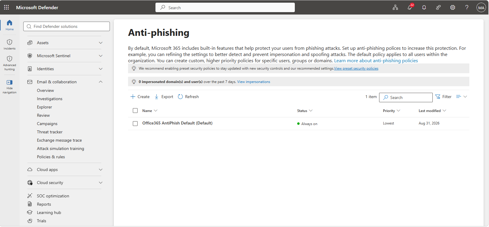

The tenant's existing anti-phishing policies: a prior test policy, the Office 365 default, and a standard recommended policy — reviewed before building a new one.

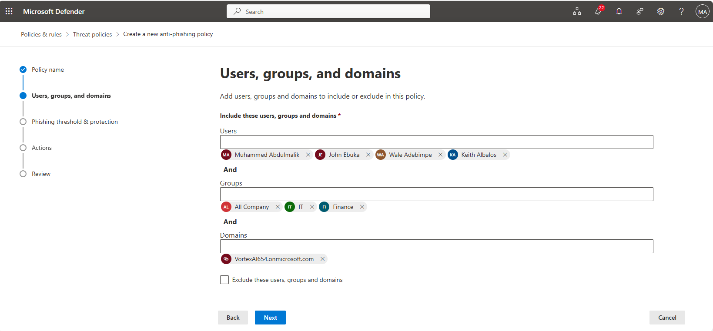

The start of the custom anti-phishing rule setup process.

---

### Step 2 — Build the custom anti-phishing policy

```powershell
New-AntiPhishPolicy `
    -Name "Anti-Phishing - Impersonation Protection" `
    -AdminDisplayName "Custom anti-phishing policy with impersonation protection for domain, mailbox intelligence, and spoof protection. Applies to all VortexAI654 tenant users." `
    -Enabled $true `
    -PhishThresholdLevel 1 `
    -EnableTargetedUserProtection $true `
    -TargetedUsersToProtect @("Muhammed Abdulmalik;malik@VortexAI654.onmicrosoft.com","Keith Albalos;keith@VortexAI654.onmicrosoft.com") `
    -TargetedUserProtectionAction Quarantine `
    -TargetedUserQuarantineTag "DefaultFullAccessPolicy" `
    -EnableOrganizationDomainsProtection $true `
    -EnableTargetedDomainsProtection $false `
    -TargetedDomainProtectionAction Quarantine `
    -TargetedDomainQuarantineTag "DefaultFullAccessPolicy" `
    -ExcludedSenders @("Muhammed Abdulmalik;<administrator's personal address>") `
    -EnableMailboxIntelligence $true `
    -EnableMailboxIntelligenceProtection $true `
    -MailboxIntelligenceProtectionAction Quarantine `
    -MailboxIntelligenceQuarantineTag "DefaultFullAccessPolicy" `
    -EnableSpoofIntelligence $true `
    -AuthenticationFailAction Quarantine `
    -SpoofQuarantineTag "DefaultFullAccessPolicy" `
    -HonorDmarcPolicy $true `
    -DmarcQuarantineAction Quarantine `
    -DmarcRejectAction Quarantine
```

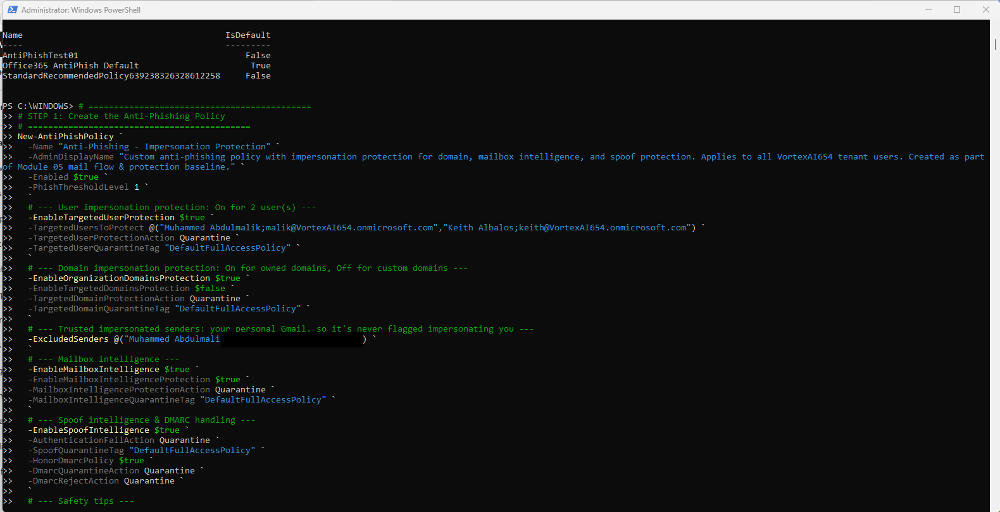

The full New-AntiPhishPolicy PowerShell command building the custom policy, with targeted user impersonation protection, mailbox intelligence, and DMARC-aware spoof handling all set explicitly.

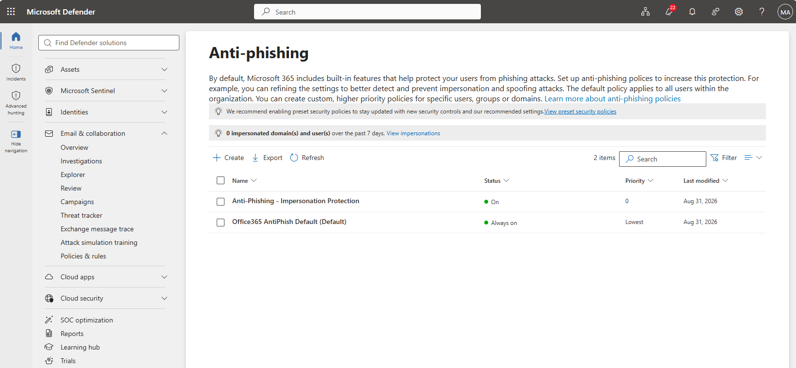

Confirmation that the custom anti-phishing policy was created.

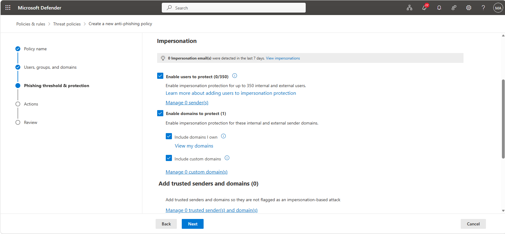

The phishing threshold and protection settings reviewed as part of the new policy.

---

### Step 3 — Roll out Safe Links and Safe Attachments

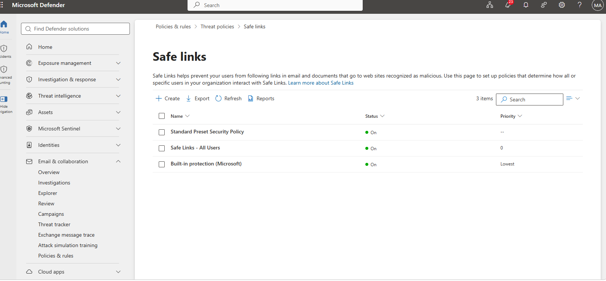

The Safe Links and Safe Attachments overview page in Defender for Office 365.

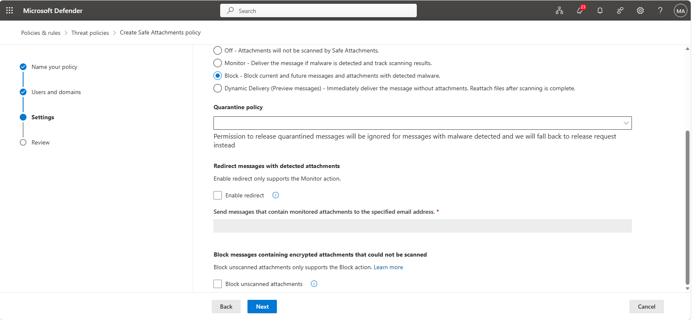

The Safe Links and Safe Attachments policy being created.

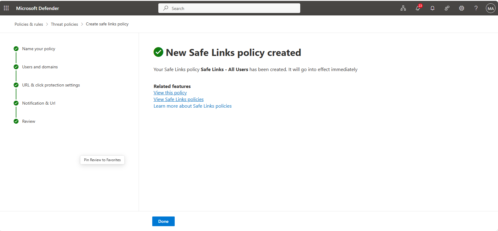

The Safe Links policy scoped to all users in the tenant.

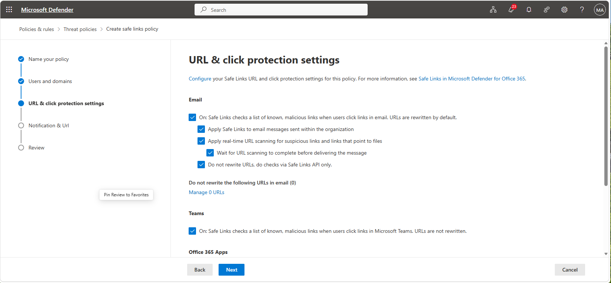

The all-users Safe Links policy being configured.

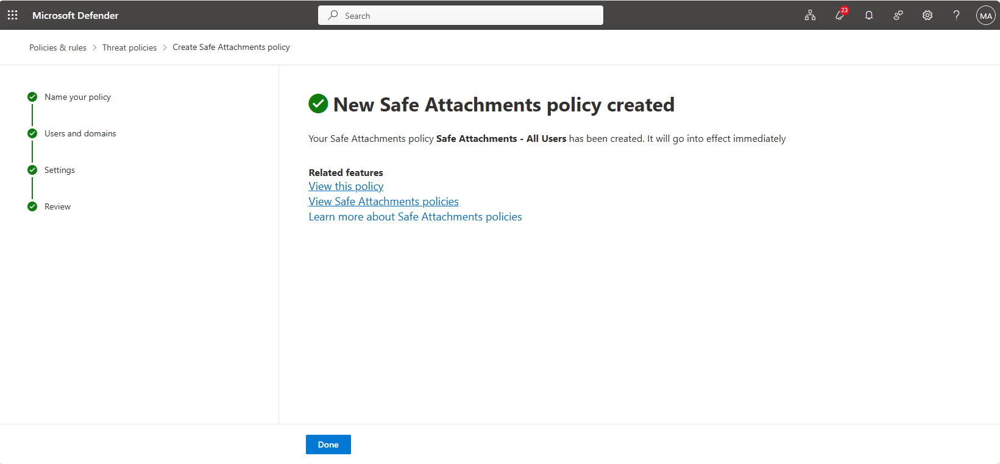

Confirmation that the Safe Attachments policy was created for all users.

---

### Step 4 — Transport rule for external mail and auto-forward control

```powershell
New-TransportRule -Name 'Block External Auto-Forward' `
    -FromScope InOrganization -SentToScope NotInOrganization `
    -MessageTypeMatches AutoForward -RejectMessageReasonText 'External auto-forwarding is disabled.'
```

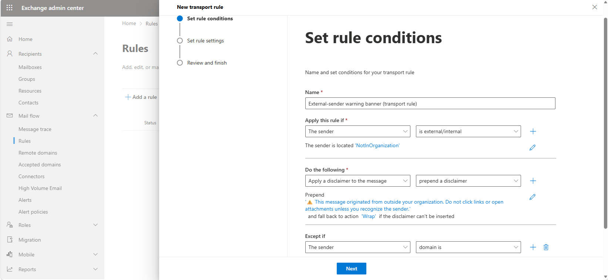

A new mail flow (transport) rule being started, to block silent external auto-forwarding.

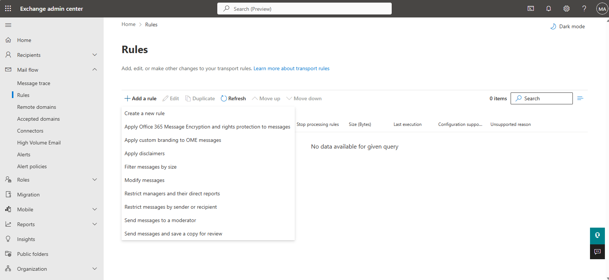

The rule's conditions and actions being added.

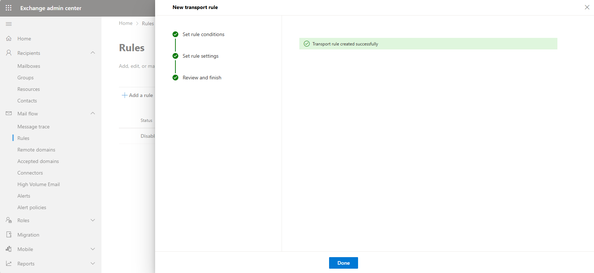

Confirmation that the transport rule was created successfully.

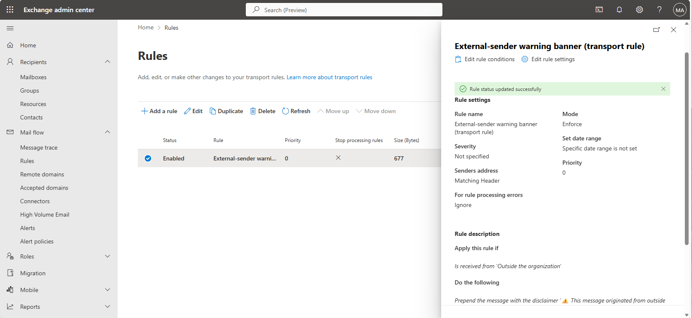

The rule shown in its enabled state.

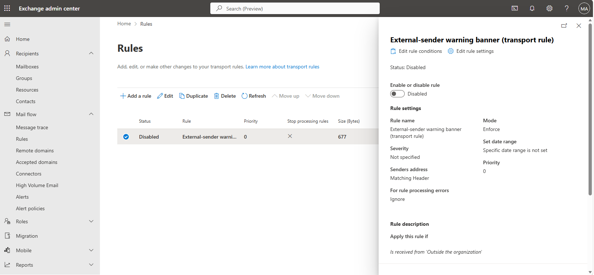

The same rule toggled to disabled, confirming the enable/disable control works in both directions.

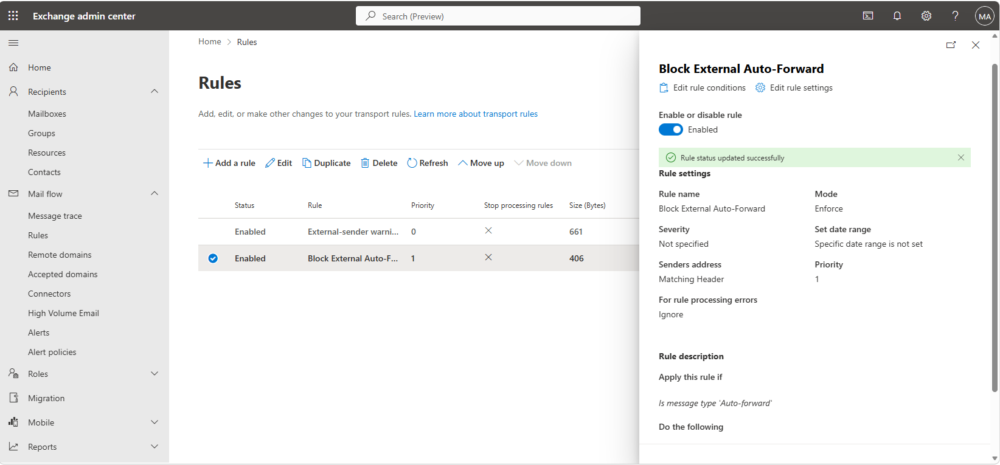

The Block External Auto-Forward rule set, enabled.

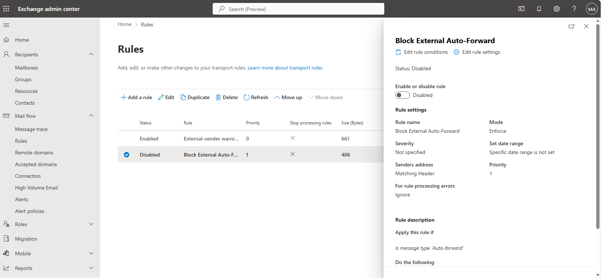

The same rule set, disabled.

---

### Step 5 — Message trace

```powershell
Get-MessageTrace -StartDate (Get-Date).AddDays(-1) -EndDate (Get-Date)
```

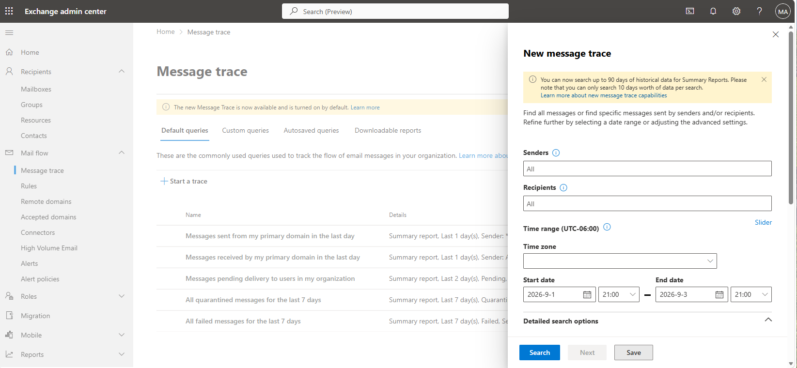

A message trace being configured to investigate mail delivery for a specific time window.

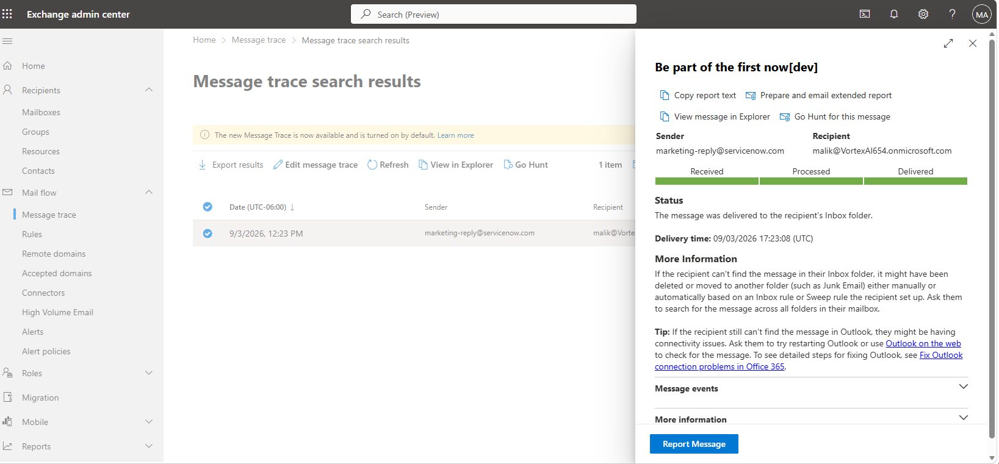

The message trace results, confirming delivery could be traced end to end.

---

## 4. Verification

| Check | Command | Success criterion |
|---|---|---|
| Anti-phishing policy | `Get-AntiPhishPolicy -Identity "Anti-Phishing - Impersonation Protection"` | Policy present, `Enabled` true |
| Targeted protection | `\| Select TargetedUsersToProtect` | Both named users present |
| Safe Links / Attachments | `Get-SafeLinksPolicy`, `Get-SafeAttachmentPolicy` | Both present, scoped to all users |
| Auto-forward block | `Get-TransportRule 'Block External Auto-Forward'` | Rule present, state matches intended enabled/disabled test |
| Message trace | `Get-MessageTrace` | Results returned for the tested time window |

---

## 5. Faults encountered

No faults were encountered during this lab.

---

## 6. Capabilities demonstrated

- Custom anti-phishing policy authoring with targeted user and domain impersonation protection
- Mailbox intelligence and DMARC-aware spoof handling configuration
- Safe Links and Safe Attachments policy rollout
- Transport rule authoring to block external auto-forwarding, with enable/disable behaviour
  verified in both directions
- Message trace for mail flow troubleshooting

---

## 7. References

| Source | Behaviour confirmed |
|---|---|
| Microsoft Learn — *Configure anti-phishing policies in EOP and Microsoft Defender for Office 365* | `New-AntiPhishPolicy` parameter behaviour, including targeted protection and DMARC handling |
| Microsoft Learn — *Safe Links and Safe Attachments* | Policy scoping to all users |
| Microsoft Learn — *Mail flow rules (transport rules)* | Auto-forward detection via `MessageTypeMatches AutoForward` |

---

## Screenshot checklist

| File | Content |
|---|---|
| `05-01-antiphish-page.png` | Existing anti-phishing policies |
| `05-02-antiphish-rule-setup.png` | Setting up the new anti-phishing rule |
| `05-03-antiphish-powershell.png` | Anti-phishing policy built via PowerShell |
| `05-04-antiphish-rule-created.png` | Anti-phishing rule created |
| `05-05-phishing-threshold-protection.png` | Phishing threshold and protection settings |
| `05-06-safe-links-attachments-overview.png` | Safe Links and Safe Attachments overview |
| `05-07-creating-safe-links-attachments.png` | Creating the Safe Links and Safe Attachments policy |
| `05-08-safe-links-all-users.png` | Safe Links scoped to all users |
| `05-09-creating-safe-links-all-users.png` | Creating the Safe Links policy for all users |
| `05-10-safe-attachments-all-users-created.png` | Safe Attachments policy created |
| `05-11-new-transport-rule-setup.png` | Setting up a new transport rule |
| `05-12-add-transport-rule.png` | Adding the rule |
| `05-13-transport-rule-created.png` | Rule successfully created |
| `05-14-transport-rule-enabled.png` | Rule enabled |
| `05-15-transport-rule-disabled.png` | Rule disabled |
| `05-16-block-auto-forward-enabled.png` | Block External Auto-Forward, enabled |
| `05-17-block-auto-forward-disabled.png` | Block External Auto-Forward, disabled |
| `05-18-message-trace-setup.png` | Setting up a message trace |
| `05-19-message-trace-results.png` | Message trace results |
