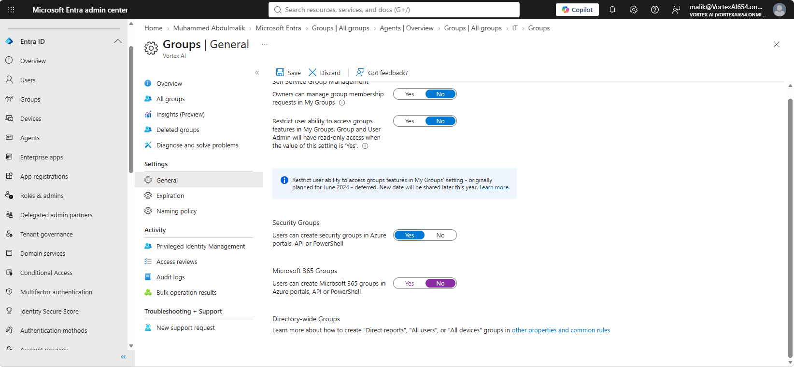
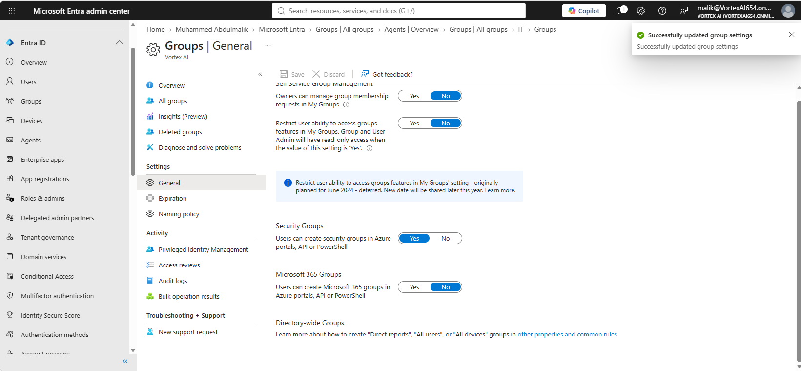
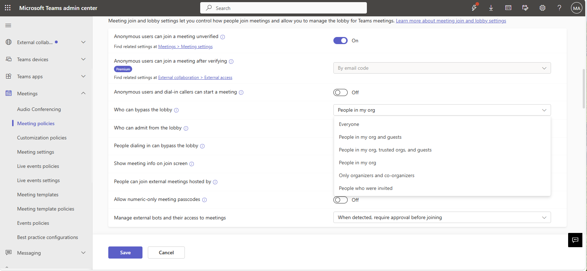
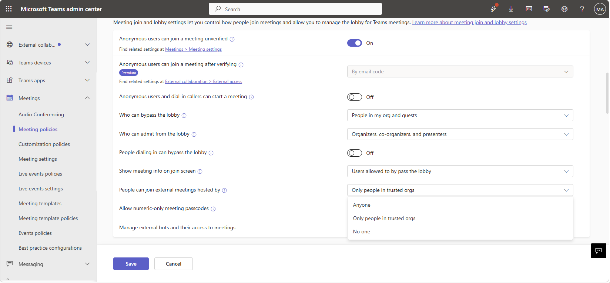
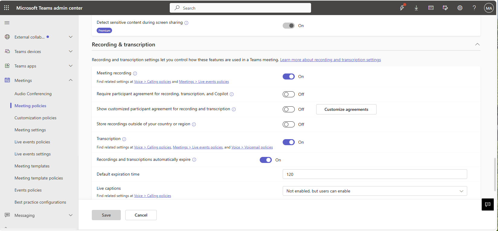
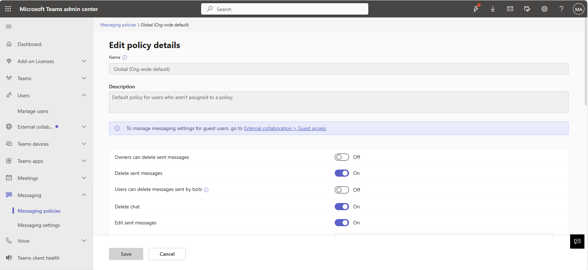
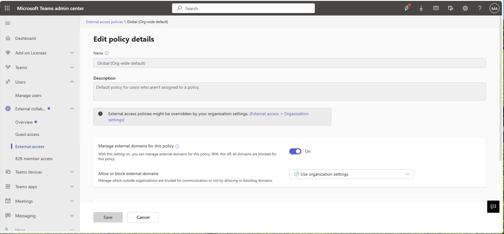
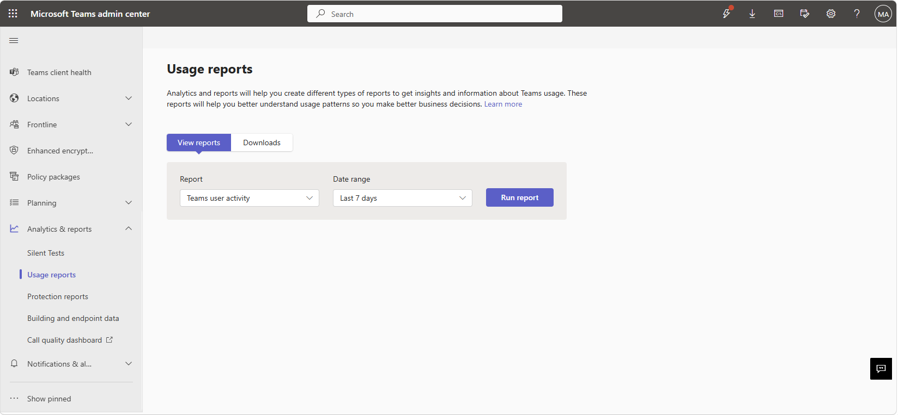

# Lab 06 — Microsoft Teams Administration

**Objective:** Restrict who can create Teams, scope meeting and messaging policy, review
external access, and confirm usage through the built-in reporting.
**Environment:** Microsoft 365 tenant `VortexAI654.onmicrosoft.com`.
**Prerequisites:** Labs 00, 01.
**Duration:** Approximately 60 minutes.

---

## 1. Scenario

Left at its defaults, Teams lets any user spin up a new team at any time, which over time
produces sprawl — duplicate teams, abandoned ones, and no clear ownership. This lab restricts
team creation to a controlled group, then scopes meeting behaviour (who can bypass the lobby,
whether recording is available) and messaging policy to match what the organisation actually
needs, rather than leaving Teams' permissive defaults in place.

---

## 2. Design decisions

| Decision | Options considered | Selected | Rationale |
|---|---|---|---|
| Team creation rights | Open to all users; restricted to a specific group | Restricted | Unrestricted team creation is the single biggest driver of Teams sprawl in real tenants. Restricting creation keeps the group structure built in Lab 01 as the actual source of truth for who has a workspace. |
| Meeting lobby policy | Everyone bypasses; only people in the organisation bypass | Org-only bypass | External participants are common for this organisation's meetings, but should still wait in the lobby rather than joining unannounced — a middle ground between "everyone waits" and "no lobby at all." |

---

## 3. Implementation

### Step 1 — Restrict who can create teams

```powershell
Connect-MicrosoftTeams
Set-CsTeamsCreationPolicy -Identity Global -AllowTeamCreation $false
```



The Teams creation policy being changed to restrict who can create new teams.



Confirmation that the restriction was saved.

---

### Step 2 — Configure meeting policy



The 'who can bypass the lobby' setting, scoped so only people inside the organisation skip the lobby.



Meeting join and lobby settings, controlling how participants enter a Teams meeting.



Recording and transcription policy settings for meetings.

---

### Step 3 — Messaging and external access policy



Messaging policy settings, controlling what chat participants can do, such as editing or deleting sent messages.



External access policy, controlling communication with people outside the organisation.

---

### Step 4 — Confirm usage via reporting

```powershell
Get-CsTeamsUsageReport
```



The Teams usage report dashboard, used to confirm the policies above are actually being exercised by real activity.

---

## 4. Verification

| Check | Command | Success criterion |
|---|---|---|
| Team creation restricted | `Get-CsTeamsCreationPolicy -Identity Global` | `AllowTeamCreation` is `False` |
| Meeting lobby policy | Teams admin center → Meeting policies | Lobby bypass scoped to organisation members |
| Usage | Teams admin center → Analytics & reports | Usage report returns data for the tenant |

---

## 5. Faults encountered

No faults were encountered during this lab.

---

## 6. Capabilities demonstrated

- Teams creation governance to control sprawl
- Meeting policy design: lobby bypass, recording, and transcription scoping
- Messaging and external access policy configuration
- Teams usage reporting and analytics

---

## 7. References

| Source | Behaviour confirmed |
|---|---|
| Microsoft Learn — *Manage who can create Microsoft 365 groups and Teams* | Team creation restriction via `Set-CsTeamsCreationPolicy` |
| Microsoft Learn — *Teams meeting policies* | Lobby bypass scoping options |

---

## Screenshot checklist

| File | Content |
|---|---|
| `06-01-restrict-team-creation.png` | Restrict who can create teams |
| `06-02-restrict-team-creation-saved.png` | Restriction saved |
| `06-03-meeting-policy-join-lobby.png` | Meeting join and lobby settings |
| `06-04-meeting-policy-lobby-bypass.png` | Who can bypass the lobby |
| `06-05-meeting-policy-recording.png` | Recording and transcription policy |
| `06-06-messaging-policy.png` | Messaging policy |
| `06-07-external-access-policy.png` | External access policy |
| `06-08-teams-usage-report.png` | Teams usage report dashboard |
