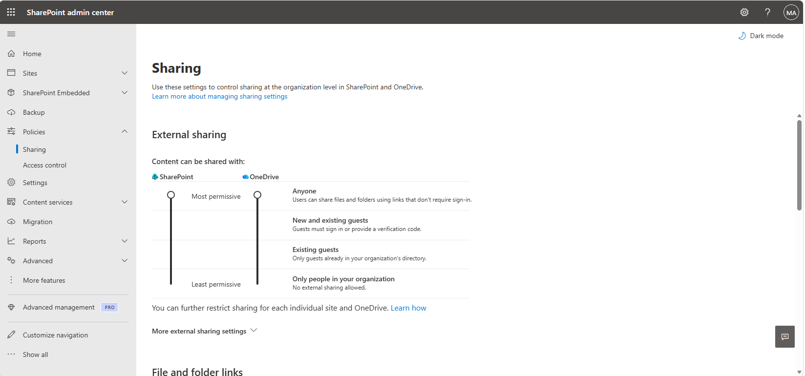
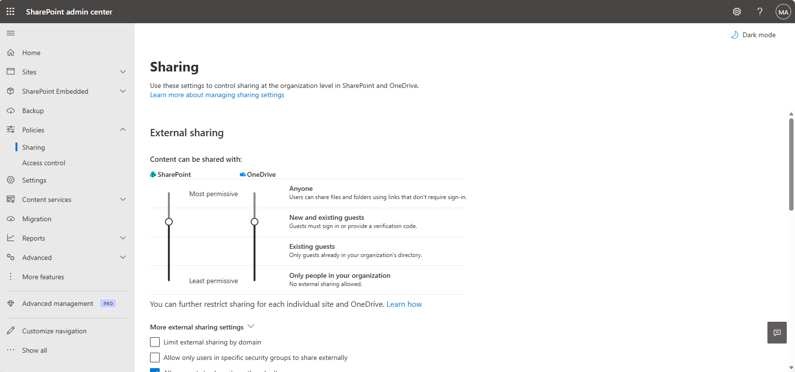
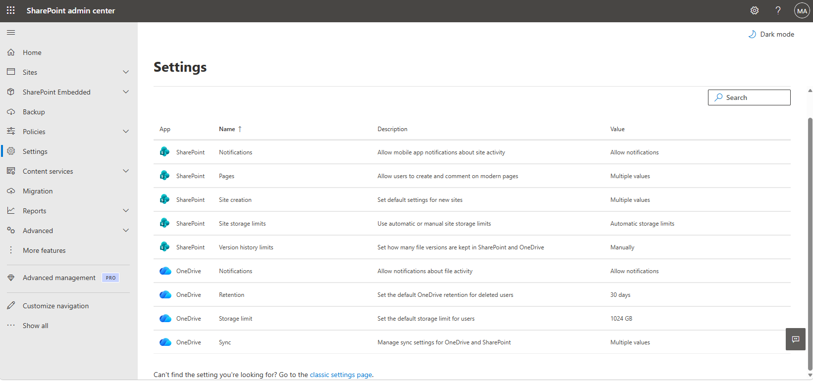
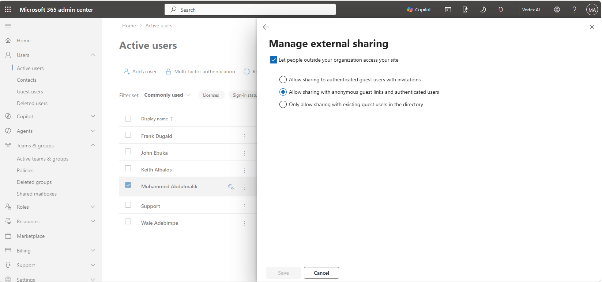
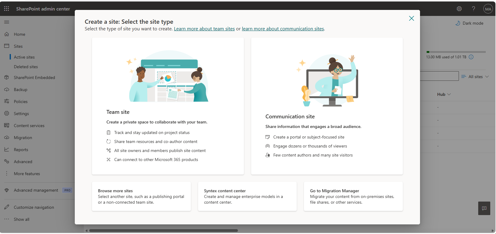
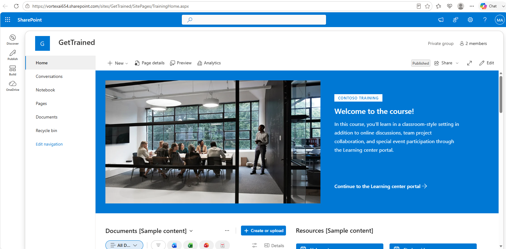
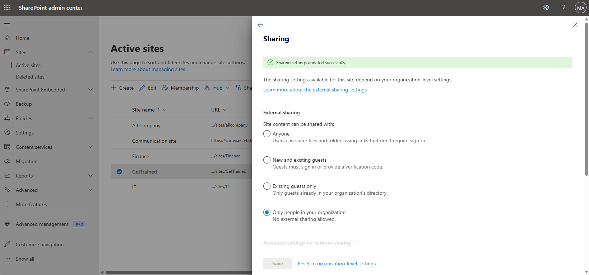
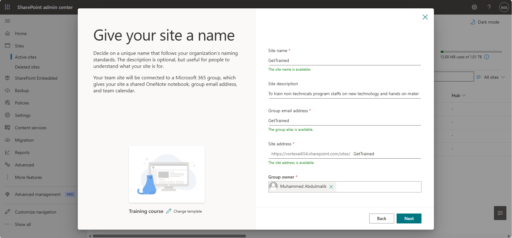

# Lab 07 — SharePoint and OneDrive Administration

**Objective:** Set organisation-level external sharing limits for SharePoint and OneDrive, then
override those limits at the site and per-user level where a specific case needs it.
**Environment:** Microsoft 365 tenant `VortexAI654.onmicrosoft.com`.
**Prerequisites:** Labs 00, 01.
**Duration:** Approximately 60 minutes.

---

## 1. Scenario

External sharing is one setting with two very different correct answers depending on who's
asking: an organisation-wide default that should be conservative, and specific sites or users
that legitimately need to share more broadly with guests. This lab sets the conservative
org-wide default first, then demonstrates both a site-level and a per-user override on top of
it — the layered model SharePoint actually uses rather than a single global switch.

---

## 2. Design decisions

| Decision | Options considered | Selected | Rationale |
|---|---|---|---|
| Org-wide sharing default | Anyone; New and existing guests; Existing guests only | New and existing guests | "Anyone" links need no sign-in at all, which is too permissive as a tenant-wide default. Requiring guests to sign in or verify by code keeps a record of who accessed shared content while still allowing legitimate external collaboration. |
| Where to loosen the default | Change the org-wide setting; override per site or per user | Override per site/user | Changing the org-wide default to suit one site's needs would loosen sharing for every other site too. A site-level override (demonstrated on a training site) and a per-user OneDrive override keep the exception scoped to where it's actually needed. |

---

## 3. Implementation

### Step 1 — Set the organisation-wide sharing default





---

### Step 2 — Configure OneDrive-specific settings

```powershell
Connect-SPOService -Url https://VortexAI654-admin.sharepoint.com
Set-SPOTenant -OneDriveStorageQuota 1048576
```



A per-user OneDrive override was also demonstrated, showing sharing can be tightened or loosened
for one person independent of the org-wide default.



---

### Step 3 — Create a site with a site-level sharing override

```powershell
New-SPOSite -Url https://VortexAI654.sharepoint.com/sites/GetTrained `
    -Owner malik@VortexAI654.onmicrosoft.com -Title 'GetTrained' -Template 'STS#3'
```







The resulting site uses SharePoint's built-in training-site template, populated with Microsoft's
own sample content.



---

## 4. Verification

| Check | Command | Success criterion |
|---|---|---|
| Org-wide sharing level | `Get-SPOTenant \| Select SharingCapability` | Set to new and existing guests |
| Site created | `Get-SPOSite -Identity .../sites/GetTrained` | Site present, template applied |
| Site-level override | `Get-SPOSite -Identity ... \| Select SharingCapability` | Differs from the org-wide default as intended |

---

## 5. Faults encountered

No faults were encountered during this lab.

---

## 6. Capabilities demonstrated

- SharePoint and OneDrive external sharing policy design at the organisation level
- Site-level and per-user sharing overrides, scoped independently of the tenant default
- Site provisioning from a built-in template
- Storage quota configuration

---

## 7. References

| Source | Behaviour confirmed |
|---|---|
| Microsoft Learn — *SharePoint and OneDrive external sharing overview* | Layered sharing model: tenant, site, and per-user scope |
| Microsoft Learn — *Manage site sharing settings* | Site-level override relative to the tenant default |

---

## Screenshot checklist

| File | Content |
|---|---|
| `07-01-sharing-settings-overview.png` | Sharing settings page, both sliders |
| `07-02-sharing-settings-guests.png` | Both sliders set to new and existing guests |
| `07-03-onedrive-settings.png` | OneDrive settings |
| `07-04-onedrive-per-user-override.png` | Per-user OneDrive sharing override |
| `07-05-site-creation-sharing-override.png` | Creating a site with a sharing override |
| `07-06-site-created.png` | Site created |
| `07-07-site-level-sharing-override.png` | Site-level sharing override applied |
| `07-08-training-site-example.png` | Resulting training site |
