# Lab 08 — Data Protection: DLP and Retention

**Objective:** Publish a sensitivity label, build a DLP policy protecting credit card numbers
across Exchange, SharePoint, OneDrive, and Teams, and apply a retention policy — rolling each
out safely before switching to enforcement.
**Environment:** Microsoft 365 tenant `VortexAI654.onmicrosoft.com`, Microsoft Purview.
**Prerequisites:** Labs 00, 01, 04, 07.
**Duration:** Approximately 75 minutes.

---

## 1. Scenario

Data protection in Microsoft 365 works in layers: a sensitivity label that marks content and
optionally encrypts it, a DLP policy that detects sensitive data patterns and blocks or warns
regardless of labelling, and a retention policy that keeps content for a defined period
independent of either. This lab builds all three, and — consistent with Conditional Access in
Lab 03 — brings the DLP policy up in simulation mode first rather than enforcing it immediately.

---

## 2. Design decisions

| Decision | Options considered | Selected | Rationale |
|---|---|---|---|
| Sensitivity label creation | Purview portal wizard; `New-Label` via PowerShell | PowerShell | The label's encryption settings, content marking footer, and tooltip text are all explicit in one script rather than split across wizard steps. |
| DLP policy rollout | Turn on immediately; run in simulation mode first | Simulation mode | A DLP policy that blocks email or file access on a false positive stops real work. Simulation mode shows every match the policy would have caught, with no user-facing impact, before it's switched on. |
| Retention scope | Retain everywhere; scope to a defined set of locations | Exchange mailboxes and OneDrive accounts | The 3-year baseline retention period is a reasonable default for correspondence and personal files specifically; applying it tenant-wide to every workload would retain content (like Teams chat) that has its own, separately-tuned retention needs. |

---

## 3. Implementation

### Step 1 — Create and publish a sensitivity label

```powershell
Enable-AipService

New-Label -Name "Confidential - Internal Only" `
    -DisplayName "Confidential - Internal Only" `
    -Tooltip "Use for sensitive business data that should stay within VortexAI654 only." `
    -EncryptionEnabled $true `
    -EncryptionProtectionType "Template" `
    -EncryptionPromptUser $false `
    -ApplyContentMarkingFooterEnabled $true `
    -ApplyContentMarkingFooterText "CONFIDENTIAL — VortexAI654 Internal Use Only" `
    -ApplyContentMarkingFooterFontsize 10
```

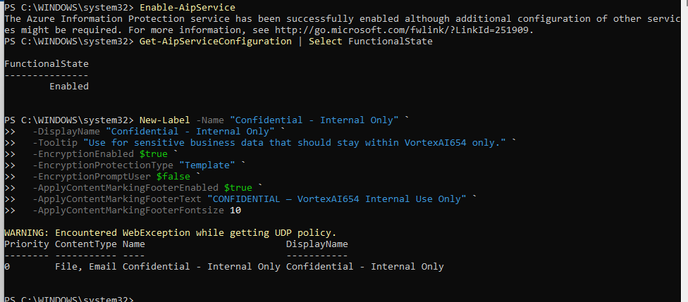

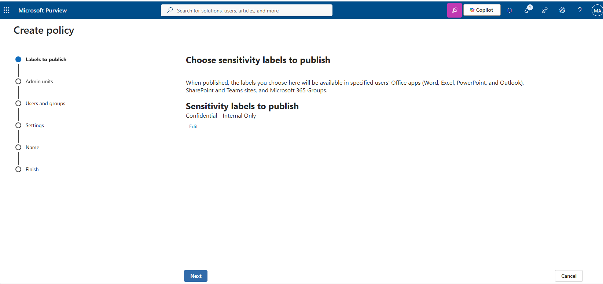

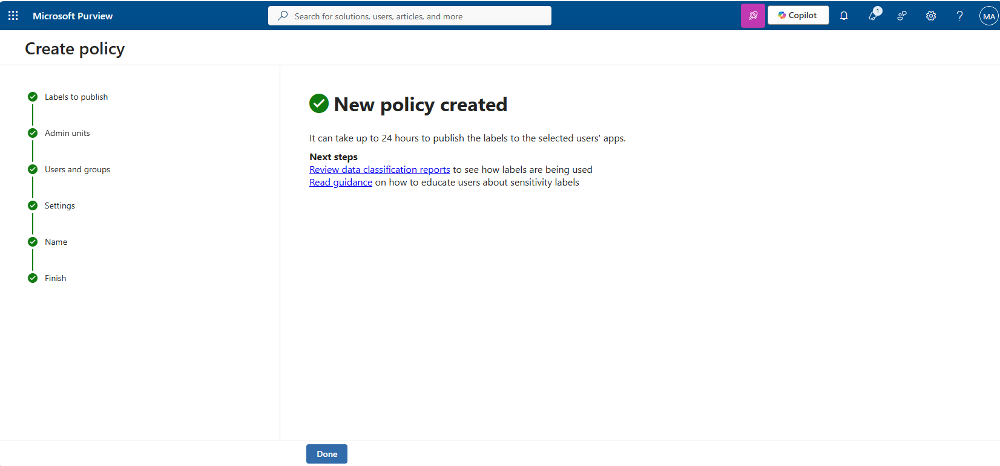

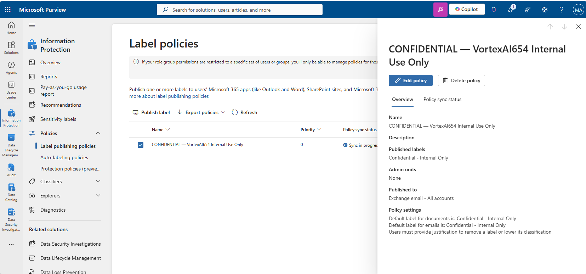

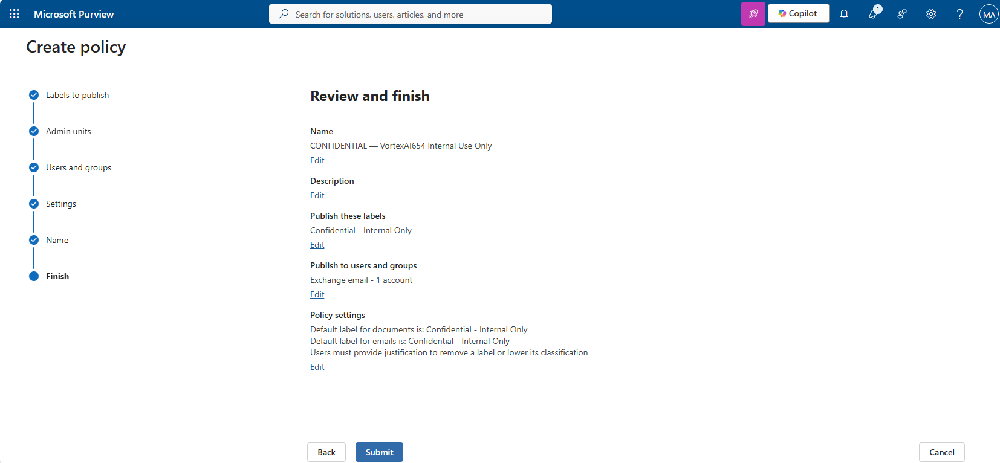

---

### Step 2 — Build the DLP policy in simulation mode

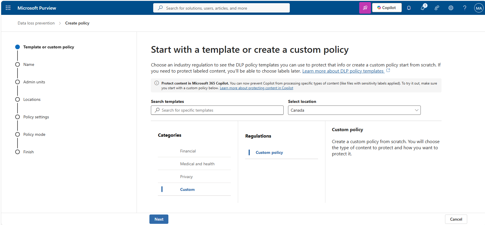

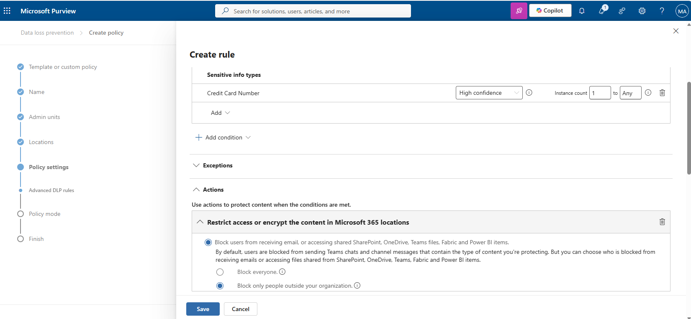

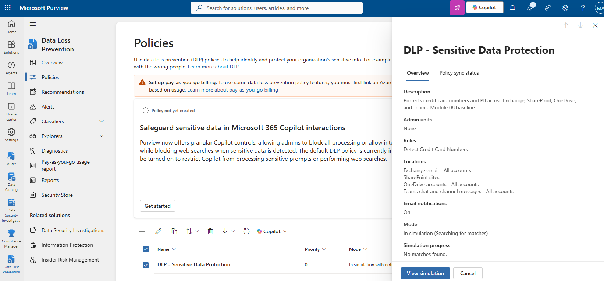

Policy mode was set to **run in simulation** rather than turned on immediately, so matches could
be reviewed before the policy could block or warn on real content.

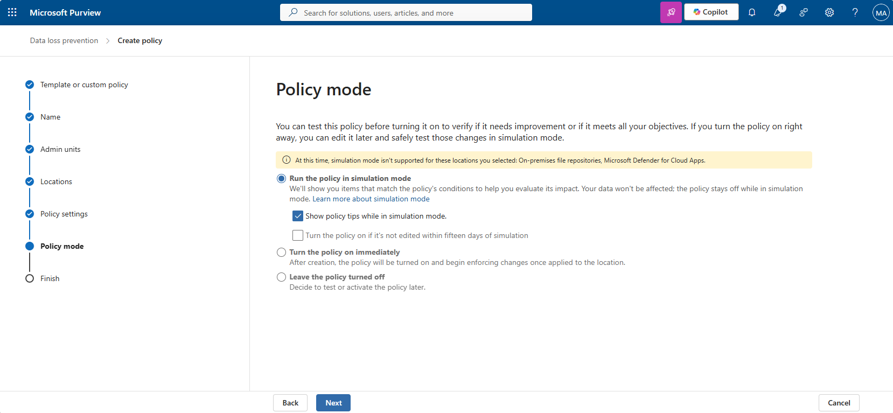

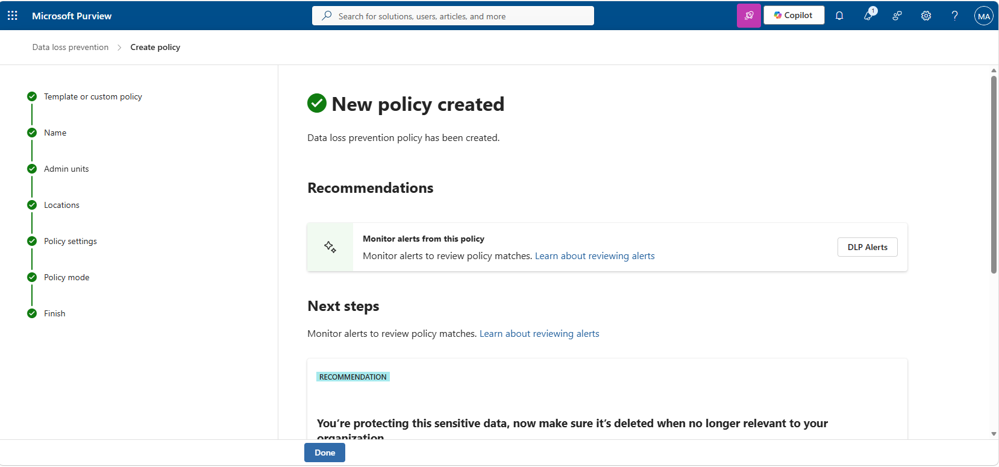

---

### Step 3 — Apply a retention policy

```powershell
New-RetentionCompliancePolicy -Name 'Retention - 3 Year Baseline' `
    -ExchangeLocation All -OneDriveLocation All

New-RetentionComplianceRule -Policy 'Retention - 3 Year Baseline' `
    -RetentionDuration 1095 -RetentionComplianceAction Delete
```

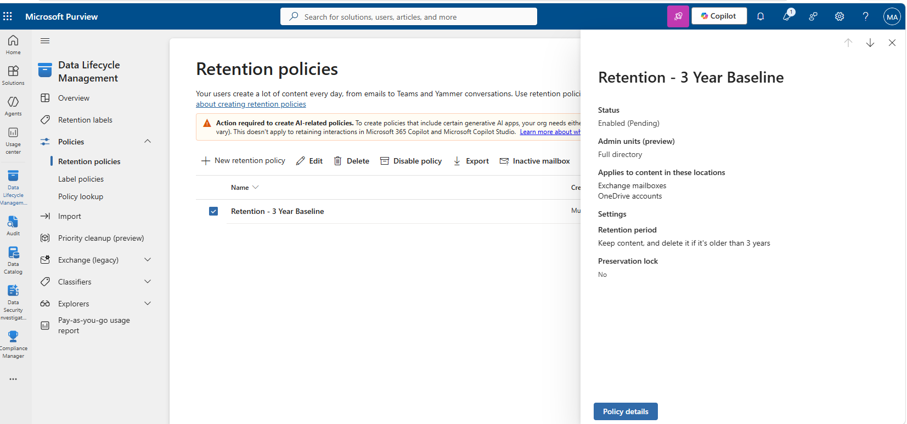

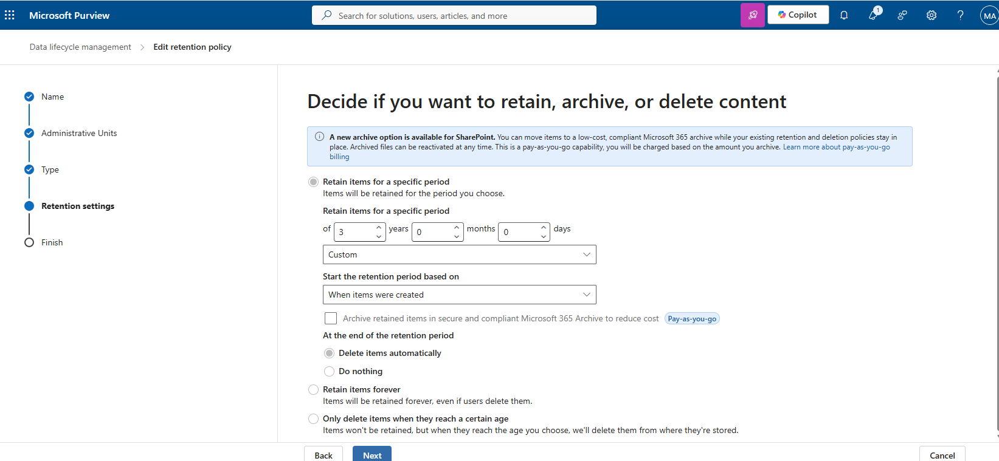

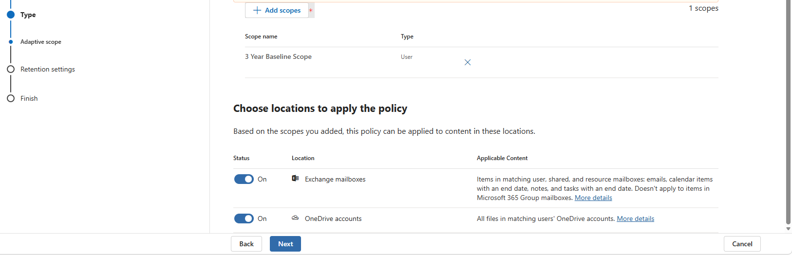

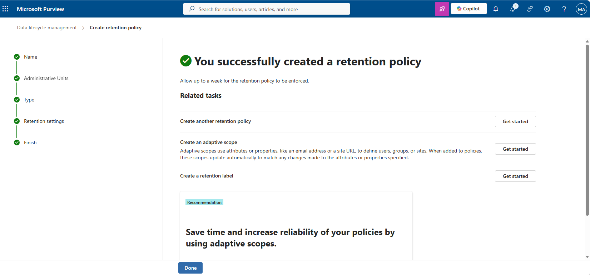

---

## 4. Verification

| Check | Command | Success criterion |
|---|---|---|
| Label published | `Get-Label`, `Get-LabelPolicy` | Label present, policy published to all accounts |
| DLP policy | `Get-DlpCompliancePolicy` | Policy present, `Mode` is `TestWithoutNotifications` or `TestWithNotifications` |
| Retention policy | `Get-RetentionCompliancePolicy` | Policy present, Exchange and OneDrive locations included |

---

## 5. Faults encountered

No faults were encountered during this lab.

---

## 6. Capabilities demonstrated

- Sensitivity label authoring with encryption and content marking
- DLP policy design for a specific sensitive-info type, rolled out in simulation mode first
- Retention policy configuration scoped to specific workloads
- Microsoft Purview compliance portal navigation across labels, DLP, and retention

---

## 7. References

| Source | Behaviour confirmed |
|---|---|
| Microsoft Learn — *Learn about sensitivity labels* | Encryption and content marking configuration via `New-Label` |
| Microsoft Learn — *Learn about data loss prevention* | Simulation mode behaviour ahead of enforcement |
| Microsoft Learn — *Retention policies* | Location scoping and automatic deletion at period end |

---

## Screenshot checklist

| File | Content |
|---|---|
| `08-01-sensitivity-label-powershell.png` | Sensitivity label created via PowerShell |
| `08-02-sensitivity-label-publish-choice.png` | Choosing the label to publish |
| `08-03-sensitivity-label-publish-confirmation.png` | Publish confirmation |
| `08-04-sensitivity-label-policy-detail.png` | Label policy detail |
| `08-05-content-marking-preview.png` | Content marking footer preview |
| `08-06-dlp-policy-template-choice.png` | DLP policy template choice |
| `08-07-dlp-policy-rule-creation.png` | DLP policy rule creation |
| `08-08-dlp-policy-overview.png` | DLP policy overview |
| `08-09-dlp-policy-mode.png` | Policy mode set to simulation |
| `08-10-dlp-policy-created.png` | New DLP policy created |
| `08-11-retention-policy-type.png` | Retention policy type |
| `08-12-retention-policy-duration.png` | Retention duration configured |
| `08-13-retention-policy-locations.png` | Retention policy locations |
| `08-14-retention-policy-created.png` | Retention policy created |
