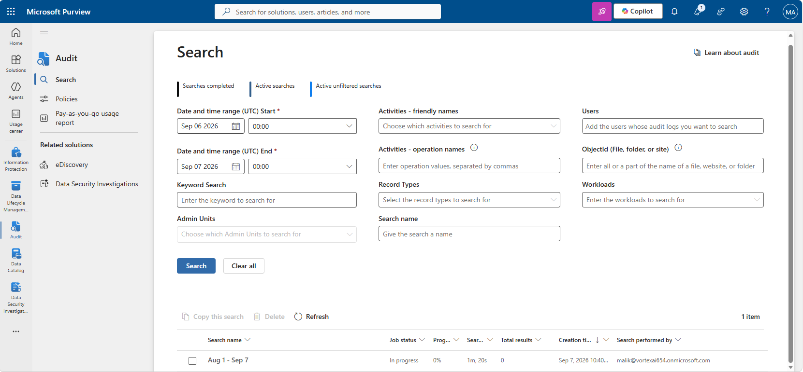
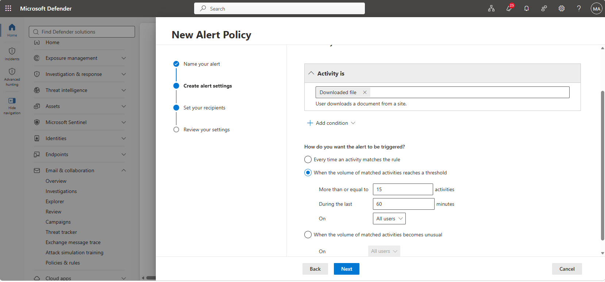
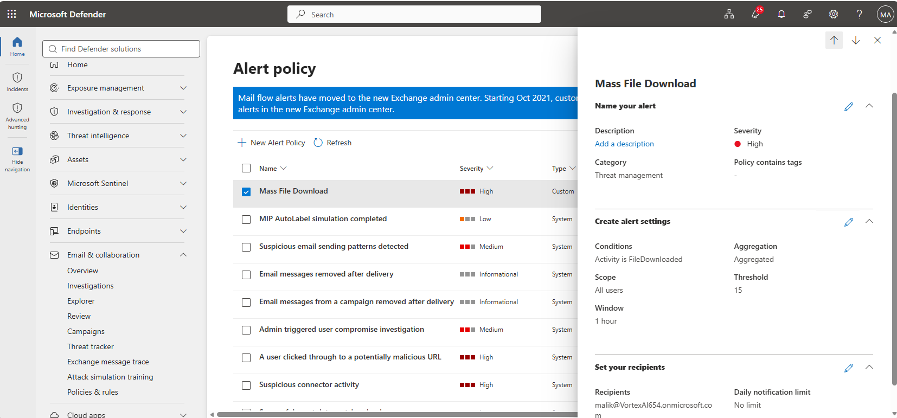
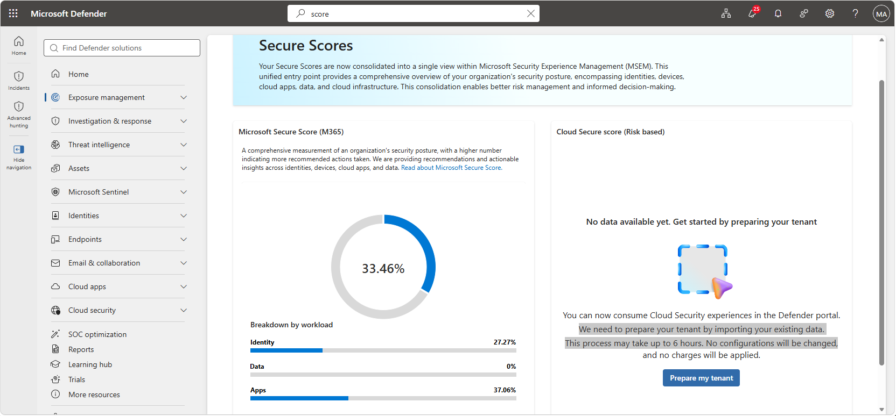
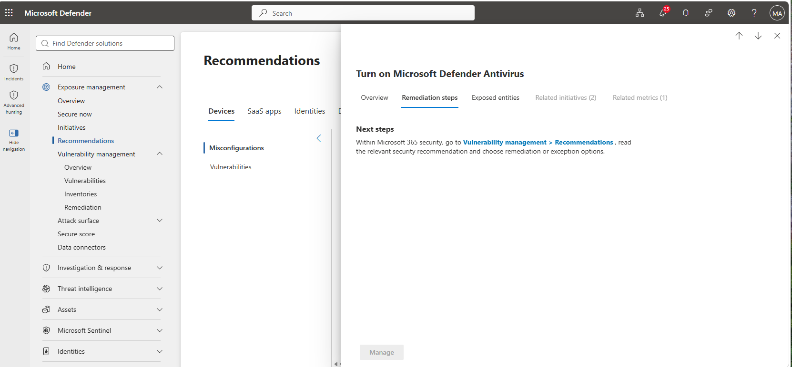
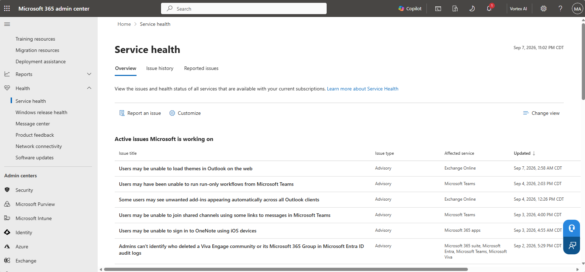
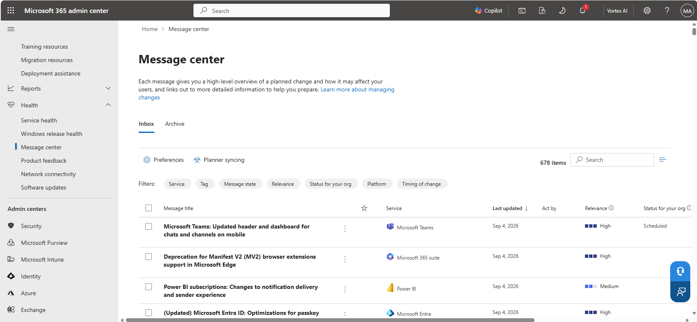
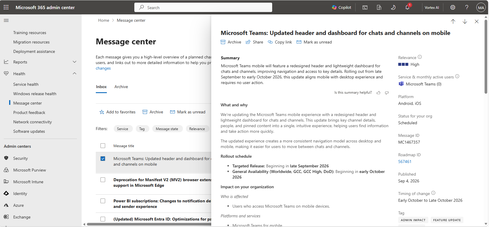
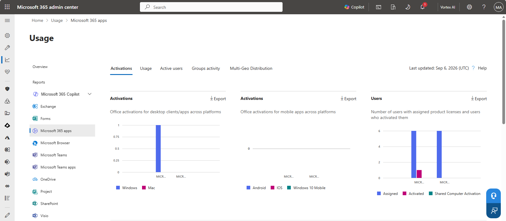

# Lab 10 — Monitoring, Auditing and Reporting

**Objective:** Search the unified audit log, configure an alert policy for anomalous activity,
review Secure Score, and use the admin center's service health and usage reporting.
**Environment:** Microsoft 365 tenant `VortexAI654.onmicrosoft.com`.
**Prerequisites:** Labs 00, 03.
**Duration:** Approximately 60 minutes.

---

## 1. Scenario

Every control built in the earlier labs is only as good as the organisation's ability to notice
when something goes wrong. This lab exercises the tenant's monitoring surface: the unified audit
log confirmed enabled back in Lab 00, an alert policy that watches for a specific anomalous
pattern, Secure Score as a standing measure of posture, and the service health and usage
reporting an administrator checks routinely rather than only when something breaks.

---

## 2. Design decisions

| Decision | Options considered | Selected | Rationale |
|---|---|---|---|
| Alert trigger | Alert on every matching event; alert on a volume threshold | Volume threshold | A single file download is routine. A "Mass File Download" alert firing at 15 or more downloads by one user within an hour catches exfiltration-shaped behaviour without paging the administrator for normal use. |
| Alert severity | Low; High | High | Mass file download is a plausible signal of a compromised account or a departing employee taking data, both time-sensitive enough to warrant immediate notification rather than a routine digest. |

---

## 3. Implementation

### Step 1 — Search the unified audit log

```powershell
Search-UnifiedAuditLog -StartDate (Get-Date).AddDays(-30) -EndDate (Get-Date) -ResultSize 5000
```



---

### Step 2 — Configure an alert policy

A **Mass File Download** alert policy was configured to trigger when one user's matched file-
download activity reaches 15 or more events within a 60-minute window.





---

### Step 3 — Review Secure Score





---

### Step 4 — Check service health and the message center







---

### Step 5 — Review usage reports



---

## 4. Verification

| Check | Command | Success criterion |
|---|---|---|
| Audit log ingestion | `Get-AdminAuditLogConfig` | `UnifiedAuditLogIngestionEnabled` is `True` |
| Alert policy | `Get-ProtectionAlert -Identity 'Mass File Download'` | Policy present, threshold and recipient correct |
| Secure Score | Defender portal → Secure Score | Score and breakdown by workload returned |

---

## 5. Faults encountered

No faults were encountered during this lab.

---

## 6. Capabilities demonstrated

- Unified audit log search and filtering
- Threshold-based alert policy design for anomalous activity detection
- Secure Score interpretation and remediation prioritisation
- Service health and message center monitoring as routine administrative practice
- Microsoft 365 usage reporting

---

## 7. References

| Source | Behaviour confirmed |
|---|---|
| Microsoft Learn — *Alert policies in Microsoft Defender* | Volume-threshold alert configuration |
| Microsoft Learn — *Microsoft Secure Score* | Score breakdown by workload (identity, data, apps) |
| Microsoft Learn — *Search the audit log* | `Search-UnifiedAuditLog` parameters and result handling |

---

## Screenshot checklist

| File | Content |
|---|---|
| `10-01-audit-log-search.png` | Audit log search |
| `10-02-alert-policy-config.png` | New alert policy configuration |
| `10-03-alert-policy-created.png` | Mass File Download alert policy created |
| `10-04-secure-score.png` | Secure Score overview |
| `10-05-secure-score-recommendation.png` | Secure Score recommendation detail |
| `10-06-service-health-overview.png` | Service health overview |
| `10-07-message-center-overview.png` | Message center overview |
| `10-08-message-center-detail.png` | Message center item detail |
| `10-09-usage-reports.png` | Usage reports |
