# Lab 11 — Lifecycle Automation

**Objective:** Build a self-service access package in Entra Entitlement Management, schedule a
recurring access review over guest access, and automate the leaver process with an Identity
Governance lifecycle workflow.
**Environment:** Microsoft 365 tenant `VortexAI654.onmicrosoft.com`, Microsoft Entra ID
Governance.
**Prerequisites:** Labs 00, 01.
**Duration:** Approximately 75 minutes.

---

## 1. Scenario

Access that's granted manually tends to be reviewed manually too, which in practice means it
often isn't reviewed at all. This lab uses Entra ID Governance to make three parts of the
identity lifecycle self-sustaining: a bundled access package staff can request instead of
asking an admin to grant each resource individually, a recurring access review that revisits
guest access on its own schedule, and a lifecycle workflow that runs the first stage of
offboarding automatically rather than depending on someone remembering to do it.

---

## 2. Design decisions

| Decision | Options considered | Selected | Rationale |
|---|---|---|---|
| Resource access | Grant each resource (Team, app, SharePoint site) individually per request | Bundle into an access package | An access package that grants Finance Team membership, the ServiceNow and Slack apps, and the Finance SharePoint site together in one request is both faster for the requestor and reviewable as a single, named entitlement rather than four separate ad hoc grants. |
| Access package expiry | No expiry; time-bound with required review | 90 days, with a review required | Access that never expires is exactly what stale-entitlement audits exist to find. A 90-day expiry with a required review forces a deliberate renewal decision rather than indefinite default access. |
| Leaver automation scope | Full offboarding automated; first-stage containment automated, rest manual | First-stage containment automated | The lifecycle workflow here runs three fast, low-risk actions — disable the account, remove from all groups, remove from all Teams — automatically on the leaver's last day. The fuller runbook (license removal, session revocation, mailbox conversion, password reset) is deliberately kept as a documented manual process in Lab 12, since those steps have more judgement calls attached (a mailbox might need to stay accessible to a manager, for instance) than a leaver's initial containment does. |

---

## 3. Implementation

### Step 1 — Build an access package

```powershell
# Entra admin center → Identity Governance → Entitlement management → Access packages → New
```

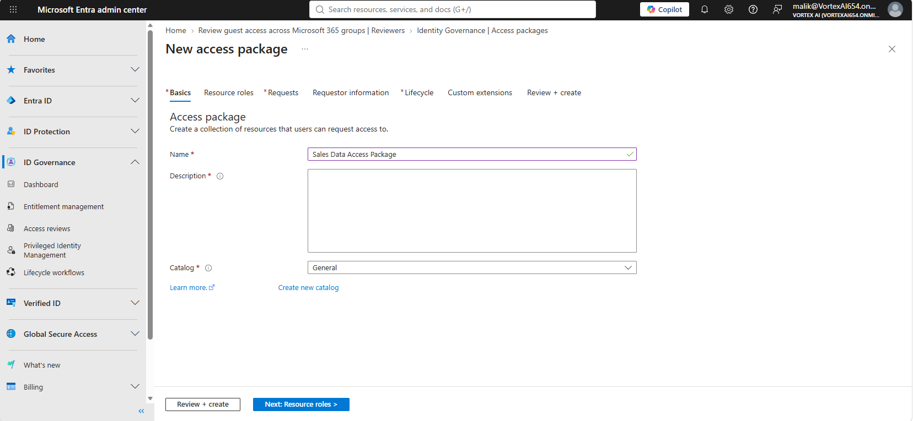

The New access package wizard, where the package's name and catalog are set.

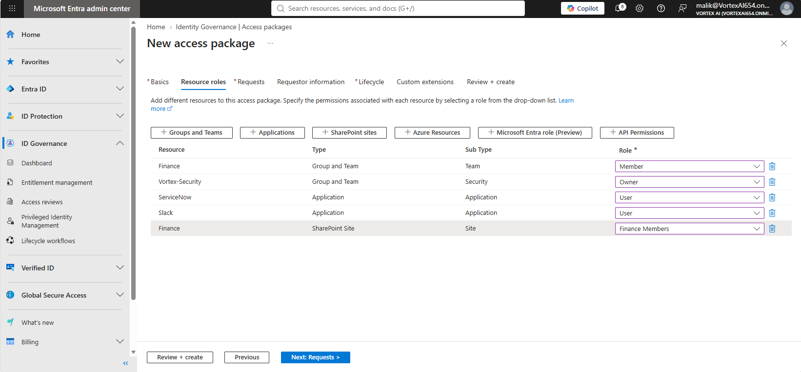

The resources bundled into the package: Finance and Vortex-Security group membership, the ServiceNow and Slack apps, and the Finance SharePoint site.

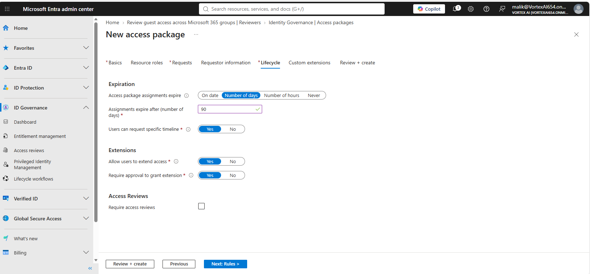

The package's lifecycle settings: assignments expire after 90 days, and extending access requires approval.

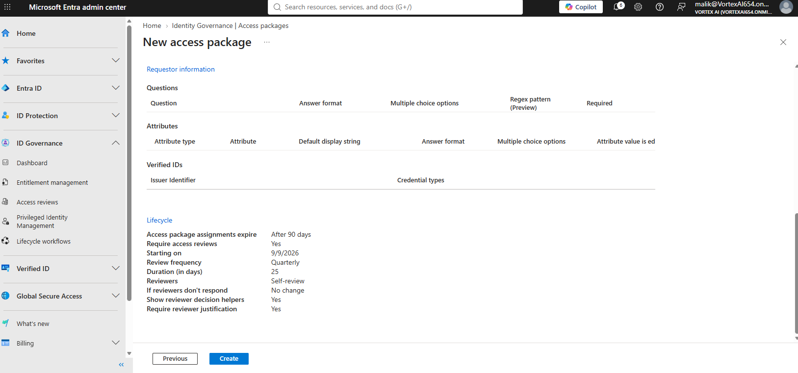

The completed package reviewed before creation, summarising its expiry, review cadence, and reviewer settings.

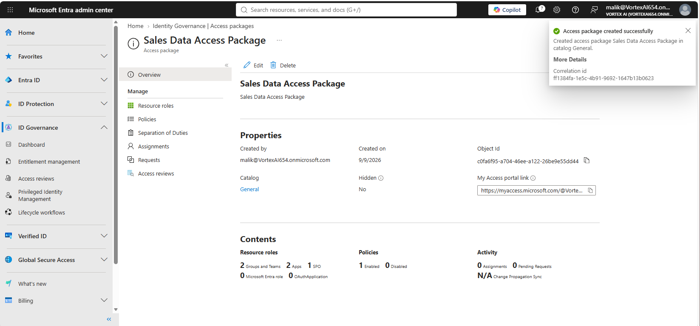

Confirmation that the 'Sales Data Access Package' was created.

---

### Step 2 — Request access through My Access

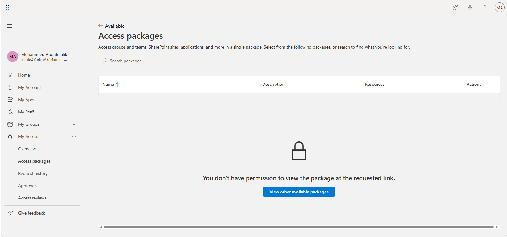

The package being located and requested through myaccess.microsoft.com, the self-service side of entitlement management.

---

### Step 3 — Schedule a recurring access review

```powershell
Connect-MgGraph -Scopes 'AccessReview.ReadWrite.All'
```

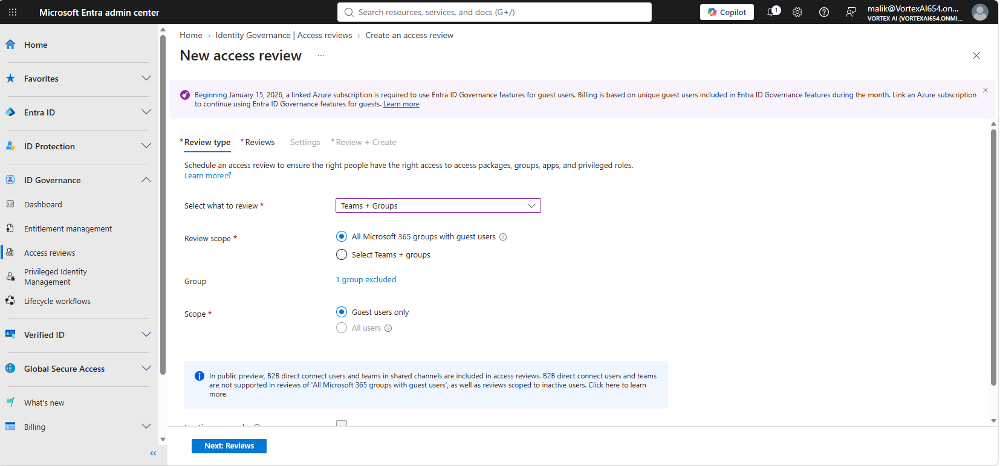

A new access review being scoped to Teams and Groups, targeting all Microsoft 365 groups with guest users.

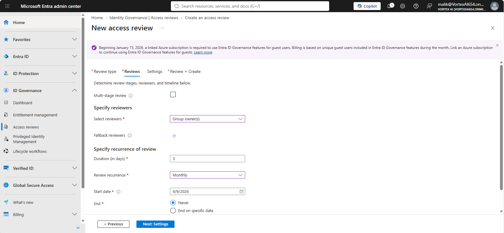

The review's reviewers set to group owners, with IT as a fallback, recurring monthly.

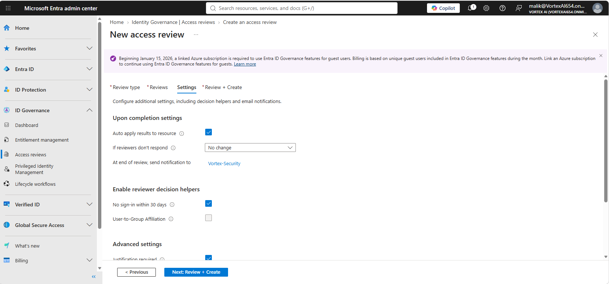

The review's completion settings: auto-apply results, and a decision helper flagging accounts with no sign-in in 30 days.

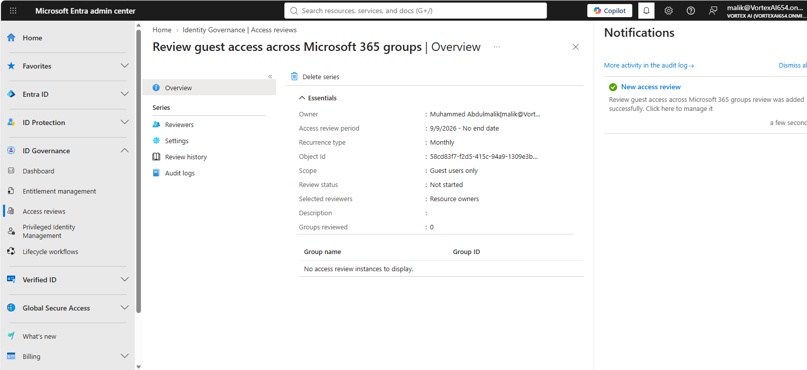

Confirmation that the access review was created.

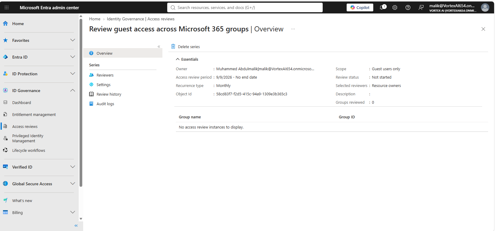

The review's overview panel, showing its recurrence and current status.

---

### Step 4 — Build the leaver lifecycle workflow


The Lifecycle workflows overview, showing the workflow engine's run schedule.

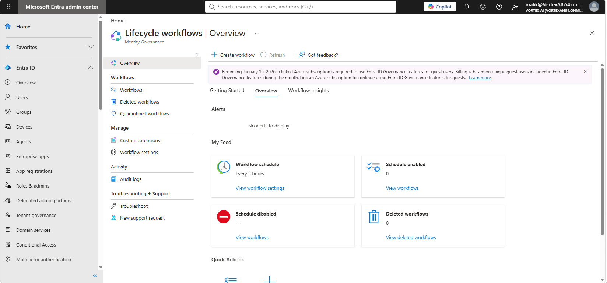

The same overview, showing workflow counts by state.

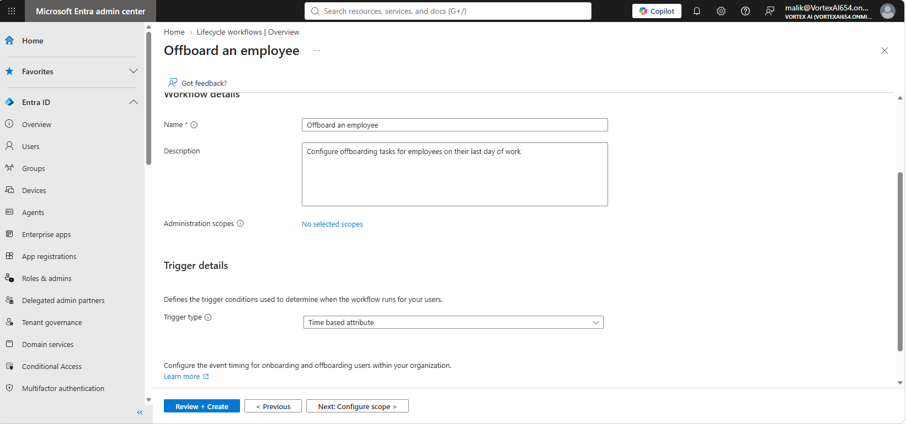

The built-in 'Offboard an employee' template being selected as the starting point for the leaver workflow.

The template's default tasks were reviewed rather than customised for this run: disable the
user account, remove the user from all groups, and remove the user from all Teams.

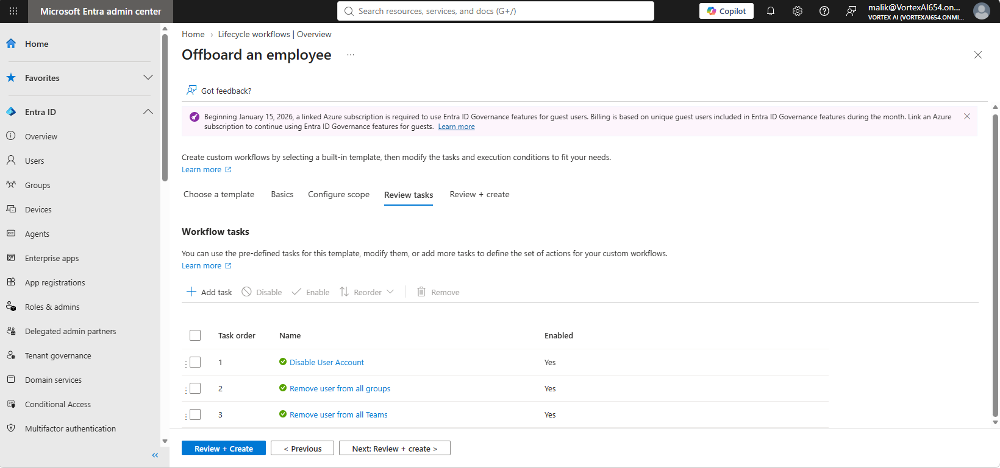

The template's default tasks: disable the user account, remove from all groups, and remove from all Teams.

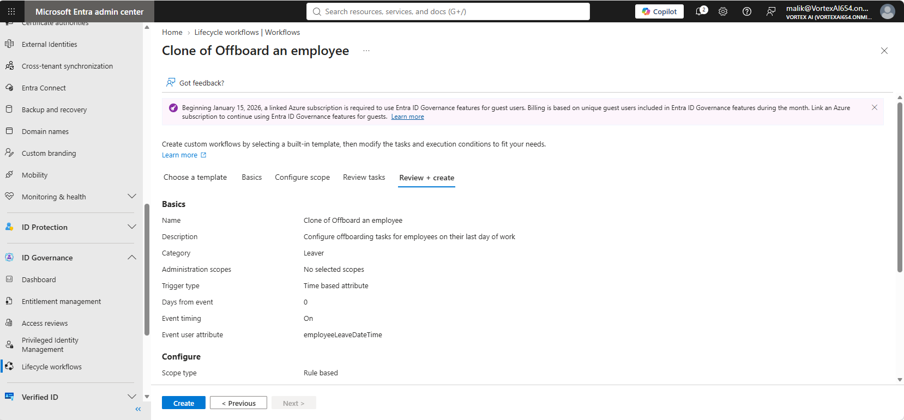

A cloned copy of the workflow reviewed before it's finalised.

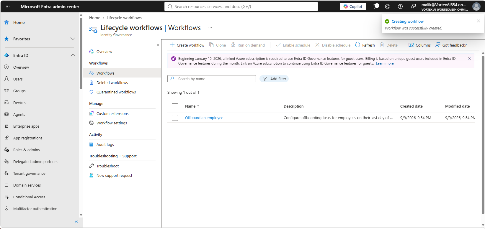

Confirmation that the offboarding workflow was created, triggered by the employeeLeaveDateTime attribute.

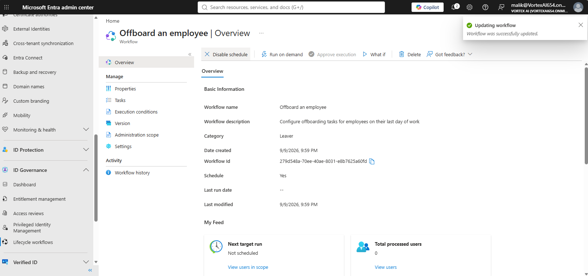

The workflow's schedule enabled, so it runs automatically rather than requiring manual triggering.

---

## 4. Verification

| Check | Command | Success criterion |
|---|---|---|
| Access package | Entitlement management → Access packages | "Sales Data Access Package" present, 90-day expiry, review required |
| Access review | Identity Governance → Access reviews | Monthly recurrence, guest-user scope confirmed |
| Lifecycle workflow | Identity Governance → Lifecycle workflows | "Offboard an employee" present, schedule enabled |

```powershell
Get-MgIdentityGovernanceLifecycleWorkflowWorkflow | Select-Object DisplayName, IsEnabled
```

---

## 5. Faults encountered

### 5.1 "You don't have permission to view the package at the requested link"

**Symptom.** Opening the access package's My Access link returned "You don't have permission to
view the package at the requested link" instead of the request page.

**Diagnosis.** The package's **Hidden** property and its configured requestor scope were
reviewed against the account used to open the link.

**Cause.** The access package was not configured to accept requests from the account being
tested with — either scoped to a specific requestor group that account isn't in, or requiring
direct assignment rather than self-service requests. The package's requestor policy (the
*Requests* tab) was not captured in the screenshots, so which of the two applied is not recorded.

**Resolution.** Confirmed as expected behaviour rather than a defect: an access package that
silently accepted requests from anyone with the link would defeat the purpose of scoping it in
the first place. The correct fix, where broader self-service access is actually intended, is to
adjust the package's requestor policy — not to treat the block itself as a bug.

---

## 6. Capabilities demonstrated

- Entitlement management: bundled, self-service access packages with expiry and review
- Recurring access reviews scoped to a specific population (guest users)
- Identity Governance lifecycle workflows for automated leaver containment
- Distinguishing what's safe to automate (fast, reversible containment) from what should stay a
  deliberate manual decision (license and mailbox handling)

---

## 7. References

| Source | Behaviour confirmed |
|---|---|
| Microsoft Learn — *What are access packages?* | Resource bundling, expiry, and review configuration |
| Microsoft Learn — *Create an access review* | Reviewer assignment and recurrence options |
| Microsoft Learn — *Lifecycle workflow templates* | Default task set for the "Offboard an employee" template |

---

## Screenshot checklist

| File | Content |
|---|---|
| `11-01-access-package-start.png` | New access package: name and catalog |
| `11-02-access-package-resource-roles.png` | Resource roles |
| `11-03-access-package-lifecycle.png` | Lifecycle tab: expiry and extension settings |
| `11-04-access-package-review.png` | Review and create |
| `11-05-access-package-created.png` | Access package created |
| `11-06-myaccess-request-access.png` | Requesting access via My Access |
| `11-07-access-review-type.png` | Access review type and scope |
| `11-08-access-review-reviewers.png` | Reviewers and recurrence |
| `11-09-access-review-settings.png` | Access review settings |
| `11-10-access-review-created.png` | Access review created |
| `11-11-access-review-overview.png` | Access review overview |
| `11-12-lifecycle-workflows-overview.png` | Lifecycle workflows overview |
| `11-13-lifecycle-workflows-overview-2.png` | Lifecycle workflows, continued |
| `11-14-offboard-template-choice.png` | Choosing the offboarding template |
| `11-15-offboard-template-tasks.png` | Template's default tasks |
| `11-16-offboard-workflow-clone-review.png` | Reviewing the cloned workflow |
| `11-17-offboard-workflow-created.png` | Offboarding workflow created |
| `11-18-offboard-workflow-schedule-enabled.png` | Workflow schedule enabled |
